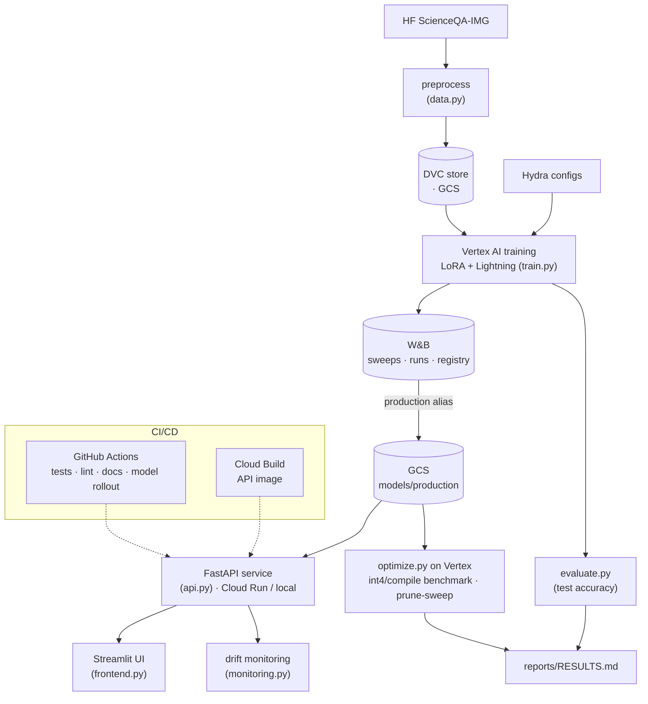

# scipali

[](https://github.com/yuxinliu42/SS26_MLOps_Project_GroupA/actions/workflows/tests.yaml)
[](https://github.com/yuxinliu42/SS26_MLOps_Project_GroupA/actions/workflows/linting.yaml)
[](https://codecov.io/gh/yuxinliu42/SS26_MLOps_Project_GroupA)

PaliGemma2-3B fine-tuned (LoRA) on ScienceQA-IMG, wrapped in a full MLOps
pipeline — DVC data versioning, Hydra configs, W&B sweeps, Vertex AI training,
Cloud Run serving, drift monitoring, and CI/CD. Headline: **72.19%** exact-match
accuracy on the 2,017-sample test split. Full results in
[`reports/RESULTS.md`](reports/RESULTS.md); usage in
[`docs/source/usage.md`](docs/source/usage.md).

## Architecture

End-to-end pipeline — data versioning, training, evaluation, model registry,
serving, monitoring, and inference optimization, glued by CI/CD:



## Project description

### Overall goal of the project
The goal of the project is to develop techniques that improve reasoning accuracy
using the PaliGemma foundation model.

### What framework are you going to use (Kornia, Transformer, Pytorch-Geometrics)
The Hugging Face **Transformers** framework (pretrained PaliGemma2), with
**PEFT/LoRA** for parameter-efficient fine-tuning, **PyTorch Lightning** for the
training loop, and **Hydra** for configuration management.

### How to you intend to include the framework into your project
We utilise one of the strengths of the Transformers framework — thousands of
pretrained models — by starting from a pretrained PaliGemma2 checkpoint and
fine-tuning it on our data, then improving from there.

### What data are you going to run on (initially, may change)
We use **[`derek-thomas/ScienceQA`](https://huggingface.co/datasets/derek-thomas/ScienceQA)**
(the image subset, "ScienceQA-IMG"). We
initially planned `lmms-lab/ScienceQA`, but that mirror ships no train split, so
we switched. Splits: train 6,218 / val 2,097 / test 2,017. Each sample has an
image, a question, answer choices, the answer index, and optional hint / lecture
plus a subject label.

### What deep learning models do you expect to use
The **PaliGemma2-3B** vision-language model
([`google/paligemma2-3b-pt-224`](https://huggingface.co/google/paligemma2-3b-pt-224)),
LoRA-adapted on the language-model attention projections with the vision encoder
frozen.

## Project structure

```txt
├── .github/workflows/      # CI: tests, linting, docs, data-change, model-registry
├── cloud/                  # Vertex AI + Cloud Build + ops scripts
├── configs/                # Hydra configs (data / model / trainer / sweep)
├── data/                   # DVC-tracked dataset (git-tracked pointers; data on GCS)
├── dockerfiles/            # api / train / predict images
├── docs/                   # MkDocs site
├── reports/                # figures, eval, profiling, monitoring, load + RESULTS.md
├── src/scipali/
│   ├── data/               # data.py, profile_data.py
│   ├── models/             # model.py, train.py, evaluate.py, optimize.py, visualize.py
│   ├── serving/            # api.py, predict.py, frontend.py, bento_service.py
│   └── monitoring/         # monitoring.py
├── tests/                  # pytest suite
├── pyproject.toml
└── tasks.py                # invoke tasks
```

## Serving

The FastAPI service (`src/scipali/serving/api.py`, image: `dockerfiles/api.dockerfile`)
serves single-sample ScienceQA predictions from the **production adapter**.

`CHECKPOINT_PATH` accepts a local adapter dir, a `.ckpt` file, or a `gs://` directory —
the stable production path is fetched at startup, so promoting a new adapter
(copy to GCS + W&B `production` alias) requires **no rebuild or redeploy**:

```bash
# local (model weights cached from HF; needs HF access for the gated base model)
CHECKPOINT_PATH=gs://mlops-paligemma-west4/models/production \
  uvicorn scipali.serving.api:app --host 0.0.0.0 --port 8000
```

### Try a prediction

Two demo paths — a terminal script and a browser UI (full details in
[`docs/source/usage.md`](docs/source/usage.md#predict--serve)):

```bash
# terminal: health → predict → drift against the live Cloud Run service
# (first call on a scaled-to-zero instance takes ~2–4 min while the model loads)
./cloud/demo_api.sh

# browser UI: Streamlit frontend over the same API — "Ask your own" mode types a
# free question; "Pick from ScienceQA" browses the local processed test split
# and compares the prediction to ground truth
API_URL=https://paligemma-api-581237630637.europe-west4.run.app \
  uvx --with requests --with pillow --with datasets \
  streamlit run src/scipali/serving/frontend.py
```

**Deployment.** The API is deployed to **Cloud Run** (`paligemma-api`,
`europe-west4`): CPU-only (8 vCPU / 32 GB), `min-instances 0` / `max-instances 3`
(scale-to-zero when idle), with lazy model loading — the container passes its
startup probe immediately and only loads the model on the first `/predict`.
Rationale for CPU over an always-on GPU endpoint: PaliGemma2-3B needs a GPU for
interactive latency, but an always-on L4 endpoint (Vertex endpoint or Cloud Run
w/ GPU) costs more than this course project justifies. In practice this means a
direct `/predict` on a cold (scaled-to-zero) instance takes ~150–230s (container
start + model load + inference bundled), while warm calls run ~25–80s — see
[`docs/source/api.md`](docs/source/api.md) for the full latency breakdown.
Promoting a new adapter needs **no image rebuild**: copy it to
`gs://…/models/production` and move the W&B `production` alias — the
model-registry-change workflow then rolls out a fresh Cloud Run revision and
smoke-tests the live endpoint automatically. The full deploy command (memory,
concurrency, and secret flags) lives in
[`docs/source/usage.md`](docs/source/usage.md#deploy-to-cloud-run).

---

Created using [mlops_template](https://github.com/SkafteNicki/mlops_template), a
[cookiecutter template](https://github.com/cookiecutter/cookiecutter) for MLOps.
