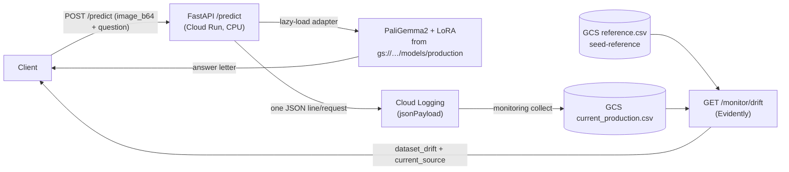

# API design

The serving API is a small FastAPI app (`scipali.serving.api`) with a health
check, single-sample inference (JSON and file-upload variants), and a
data-drift check. The full request/response models are validated by Pydantic
and published as OpenAPI at `/openapi.json`, with interactive docs at `/docs`
(Swagger) and `/redoc`.

## Endpoints

| Method & path        | Purpose                          | Body / params                         | Returns |
|----------------------|----------------------------------|---------------------------------------|---------|
| `GET /`              | Health + model-loaded flag       | —                                     | `{status, model_loaded}` |
| `POST /predict`      | Inference on one ScienceQA item  | `PredictRequest` (JSON)               | `{prediction}` — the answer letter |
| `POST /predict-file` | Same inference, browser-friendly | `multipart/form-data`: `image` file + form fields | `{prediction}` — the answer letter |
| `GET /monitor/drift` | Evidently input data-drift check | `current_gcs` (optional gs:// override) | `DriftResponse` |
| `GET /metrics`       | Prometheus system metrics  | —                                     | Prometheus text exposition |

`/metrics` is added by `prometheus-fastapi-instrumentator` (request counts by
method/status/handler, latency histograms, request/response sizes) and can be
scraped by Managed Prometheus. It is instrumented defensively, so the API still
runs without the optional dependency.

### `POST /predict`

```jsonc
// request — PredictRequest
{
  "question": "Which property do these objects have in common?",  // required, ≥1 char
  "choices": ["soft", "salty", "sticky"],                          // required, 2–10 items
  "hint": "",                                                      // optional, appended to prompt
  "lecture": "",                                                   // optional, appended to prompt
  "image_b64": "<base64 JPEG/PNG>",                                // required
  "max_new_tokens": 10                                             // optional, 1–128
}
// response — PredictResponse
{ "prediction": "C" }   // a single normalised answer letter (A/B/C/…)
```

### `POST /predict-file`

The `multipart/form-data` twin of `/predict`, added so the Swagger UI renders
a real file-upload button (a browser cannot send a local file path, and JSON
cannot carry a file). The image travels as an uploaded file; the choices
travel as one comma-separated string, mirroring the predict CLI. Both
endpoints share the same inference path and emit the same drift-monitoring
log event.

```bash
curl -s -X POST "$API/predict-file" -F image=@img.png \
  -F "question=What is the capital of Wyoming?" \
  -F "choices=Phoenix,Baton Rouge,Honolulu,Cheyenne"
# -> {"prediction":"D"}
```

### `GET /monitor/drift`

```json
{
  "dataset_drift": true,
  "n_drifted_columns": 7,
  "n_columns": 7,
  "reference_rows": 6218,
  "current_rows": 6,
  "current_source": "gs://mlops-paligemma-west4/monitoring/current_production.csv"
}
```

`current_source` reports which "current" table was actually compared, so the
verdict is never silently a self-comparison (see the drift loop below).

## Request flow & drift loop



## Design choices

- **On-demand, scale-to-zero serving (no always-on GPU).** Cloud Run runs the
  3B model on CPU (`--memory 32Gi --cpu 8`), `min-instances 0`, with **lazy
  loading** (`LAZY_LOAD=1`): the container passes the startup probe immediately
  and loads the model on the first `/predict`. `GET /` never touches the model,
  so it only measures container start (~45 s) — the number that matters is a
  direct `/predict` from a scaled-to-zero instance, which bundles container
  start + model load + inference into one figure: **~150–230 s (typically
  ~160–175 s)**. Once warm, calls run **~25–80 s (commonly ~35–50 s)** — CPU-bound
  generation length varies, and sustained back-to-back calls have shown a longer
  tail, plausibly once `--startup-cpu-boost`'s window closes. Cheaper than a
  standing GPU endpoint for a course-scale workload.
- **The adapter is read from `gs://…/models/production` at startup**, not baked
  into the image, so promoting a new model needs no rebuild/redeploy — re-copy
  the adapter and move the W&B `production` alias.
- **One inference per instance** (`concurrency 1`) avoids OOM on the 3B model;
  `max-instances 3` lets overflow spin a new instance instead of returning 429.
- **Drift tables live in GCS, not the image** (`reference.csv`,
  `current_production.csv`, `current_sample.csv`), so the input distribution can
  be refreshed without a redeploy. `reference.csv` is regenerable from committed
  code via `monitoring seed-reference`; `current_production.csv` is materialised
  from real traffic by `monitoring collect`.
- **`/predict` logs one structured single-line JSON per request** (severity
  `INFO`) straight to stdout, *not* through the Rich logger. Rich renders at a
  fixed 80-column width and Cloud Run stores each wrapped line as a separate
  entry, which would fragment the JSON and break `collect`. A lone JSON object
  is parsed by Cloud Run into `jsonPayload` and read back intact, closing the
  drift loop end-to-end.
- **The drift comparison uses only the columns both tables share.** Production
  inputs can't carry train-only columns (e.g. `subject`, unknown at inference
  time), so the endpoint intersects columns rather than erroring or registering
  spurious drift.
