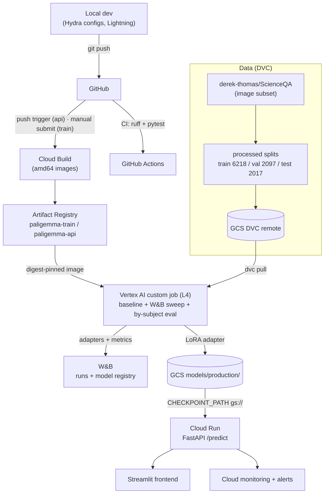

# Architecture

The pipeline goes from local development through CI and Cloud Build into Vertex
AI for GPU work, with artifacts in GCS / W&B and serving on Cloud Run.

## Key design choices

- **Secrets** live in Secret Manager; job specs carry only secret *names*, and
  jobs run as the compute service account (which holds `secretAccessor`).
- **Images are digest-pinned** at submit time — Vertex resolves `:latest` at
  container start, which can drift across a long Flex Start queue.
- **Serving reads the adapter from `gs://…/models/production`** at startup, so
  promoting a new model needs no redeploy — just re-copy the adapter and move
  the W&B `production` alias.
- **`val/accuracy` is the sweep metric**, not `val/loss`: the two disagree, and
  the task is scored on exact-match of the answer letter.
