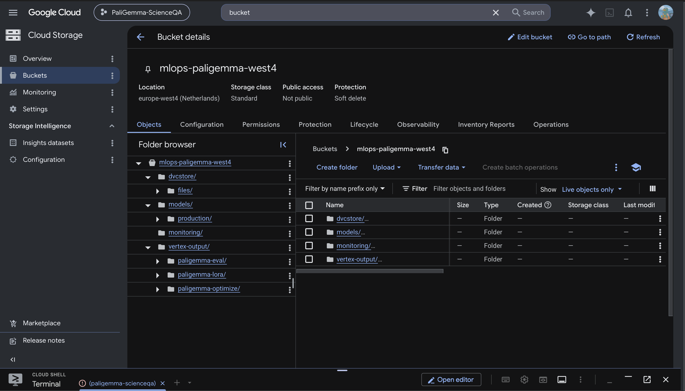
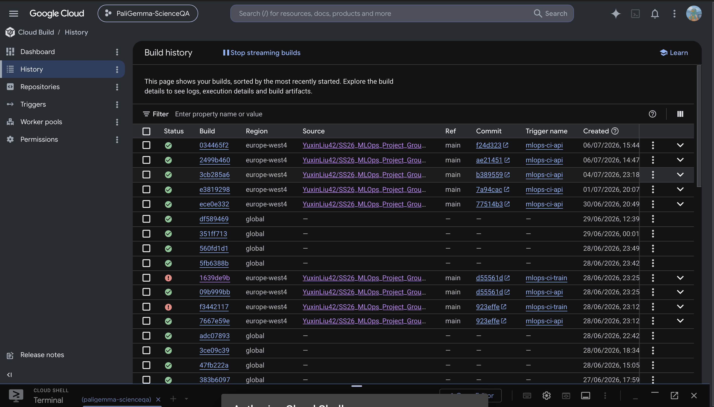

# Exam report for MLOps LMU SS26

## Group information

### Question 2
> **Enter the study number for each member in the group**
>
> Answer:

Yuxin Liu [TODO: student number]
Duc-Anh Valentino Nguyen 12433139

## Coding environment

> In the following section we are interested in learning more about your local development environment.

### Question 3

> **What framework did you choose to work with and did it help you complete the project?**
> Answer:

We used the Hugging Face **Transformers** framework with the **PaliGemma2-3B**
vision-language model ([`google/paligemma2-3b-pt-224`](https://huggingface.co/google/paligemma2-3b-pt-224)), fine-tuned with **PEFT/LoRA**
for parameter-efficient adaptation, **PyTorch Lightning** for the training loop,
and **Hydra** for configuration management.

Transformers gave us a ready pretrained VLM and matching processor, so we could
start from a strong checkpoint instead of training from scratch. LoRA made
fine-tuning a 3B-parameter model tractable on a single L4 GPU (only ~6.4M of the
~3B parameters are trainable). Lightning removed most of the training-loop
boilerplate (checkpointing, early stopping, the test/validation loop, logging
hooks), and Hydra let us compose and override hyperparameters from the CLI
(`configs/data`, `configs/model`, `configs/trainer`, `configs/sweep`) without an
ad-hoc argparser. All four were used as intended and materially sped up
development.

### Question 4

> **Explain how you managed dependencies in your project? Explain the process a new team member would have to go**
> **through to get an exact copy of your environment.**
>
> Answer:

We manage dependencies with **`uv`**, not conda/pip. `pyproject.toml` declares
the dependencies and dependency-groups (`dev`, `serving`, `monitoring`, `data`),
and `uv.lock` pins exact resolved versions; `.python-version` pins the
interpreter. CI and Docker builds use `uv sync --frozen`/`--locked` so the
locked versions are reproduced exactly, never re-resolved.

To get an exact copy of the environment, a new team member would run:

```bash
git clone git@github.com:yuxinliu42/SS26_MLOps_Project_GroupA.git
cd SS26_MLOps_Project_GroupA
uv sync --locked --dev
dvc pull   # fetch the processed dataset from the GCS remote
```

`uv lock --check` verifies the lockfile is still in sync with `pyproject.toml`
before merging. Docker images (`dockerfiles/*.dockerfile`) use the same
`uv sync --frozen` step, so the local, CI, and container environments are all
built from the same lockfile.

### Question 5

> **We expect that you initialized your project using the cookiecutter template. Explain the overall structure of your code. Did you fill out every folder or only a subset?**
>
> Answer:

The project was initialized from
[SkafteNicki/mlops_template](https://github.com/SkafteNicki/mlops_template).
We filled out: `data/` (DVC-tracked pointers to the processed ScienceQA-IMG
splits), `src/scipali/` — split into `data/` (download + preprocess),
`models/` (model, train, evaluate, optimize, visualize), `serving/` (FastAPI
app, predict CLI, Streamlit frontend, BentoML service), and `monitoring/`
(drift detection); `configs/` (Hydra config groups); `dockerfiles/` (three
images); `tests/` (pytest suite); `docs/` (MkDocs site, published to GitHub
Pages).

We removed `notebooks/` (all experimentation went through Hydra-configured
scripts, not notebooks) and did not use a `references/` folder. We added two
things not in the base template: `cloud/` (Vertex AI + Cloud Build + ops
scripts) and a `monitoring/` subpackage under `src/scipali/`, since the
template doesn't anticipate a deployed-model monitoring loop.

### Question 6

> **Did you implement any rules for code quality and format? Additionally, explain with your own words why these**
> **concepts matters in larger projects.**
>
> Answer:

Yes. We use **ruff** for both linting and formatting (replacing
black/isort/flake8 with one faster tool), **mypy** for static type checking,
and **pre-commit** hooks (`trailing-whitespace`, `end-of-file-fixer`,
`check-yaml`, `check-added-large-files`, `ruff --fix`, `ruff-format`) that run
on every commit. All three (ruff lint, ruff format check, mypy) are also
enforced in CI (`.github/workflows/linting.yaml`), so a non-compliant change
cannot be merged even if a hook was skipped locally. Public functions carry
type hints and short Args/Returns docstrings.

These rules matter more as a project grows because consistent formatting and
typing remove an entire class of bikeshedding and reviewing friction — a
reviewer can focus on logic instead of style, static types catch a class of
bugs before runtime, and a shared, enforced style means any contributor
(including a future one who wasn't on the original team) can read unfamiliar
code without adapting to a different author's personal conventions.

## Version control

> In the following section we are interested in how version control was used in your project during development to
> corporate and increase the quality of your code.

### Question 7

> **How many tests did you implement?**
>
> Answer:

132 tests (`tests/`), covering the data pipeline, model/training code, the
FastAPI serving endpoints, and the monitoring/drift logic.

### Question 8

> **What is the total code coverage (in percentage) of your code? If you code had an code coverage of 100% (or close**
> **to), would you still trust it to be error free? Explain you reasoning.**
>
> Answer:

Total coverage is **~71%** of `src/scipali` (`uv run coverage report`),
computed in CI on every push and uploaded to Codecov. CI installs the
optional monitoring extras (`--group monitoring`) so the import-guarded
lines — the Prometheus `/metrics` instrumentation and the Evidently
drift-report body — are exercised there too, keeping the local number and
the Codecov badge in agreement.

No — 100% coverage would only mean every line *executed* at least once during
testing, not that the code is correct. It says nothing about whether the
*assertions* are meaningful, whether edge cases and unusual inputs are
exercised, or whether two covered lines interact incorrectly together. A test
that calls a function and checks nothing meaningful still counts as "covered."
We treat coverage as a floor that flags obviously-untested code, not a
correctness guarantee — e.g. our own gaps are concentrated in `train.py`
(GPU-only training loop, not exercised by the fast CPU unit-test suite) and
parts of `model.py`/`monitoring.py`, which are covered by integration-level
checks (a real Vertex AI run, a real drift report) rather than unit tests.

### Question 9

> **Did your workflow include using branches and pull requests? If yes, explain how. If not, explain how branches and**
> **pull request can help improve version control.**
>
> Answer:

Yes. Changes went into feature branches and were merged into `main` via pull
requests rather than pushed directly — the repository history shows PR merges
(e.g. `Merge pull request #9 from DucAnhValentinoNguyen/test`). Since `main` is
wired to CI (tests + linting on every push/PR) and to automatic deployment
(Cloud Build rebuilds the API image, and later in the project a
model-registry-change workflow rolls a promoted model out to Cloud Run), a
broken `main` has real consequences beyond code review — so keeping changes in
a branch until CI is green before merging was the main practical benefit,
alongside the usual review/diff-visibility benefit of a PR.

### Question 10

> **Did you use DVC for managing data in your project? If yes, then how did it improve your project to have version**
> **control of your data. If no, explain a case where it would be beneficial to have version control of your data.**
>
> Answer:

Yes. DVC tracks the processed ScienceQA-IMG splits, with a GCS remote
(`gs://mlops-paligemma-west4/dvcstore`). `.dvc/config` sets `no_scm=true`
because the training/optimize Docker images ship the `.dvc` pointer files
without a `.git` directory (so DVC can't detect a git repo inside the
container), and `dvc pull` needs to work in that no-SCM mode.

DVC let us keep the (large, binary) image data out of git entirely while still
versioning exactly which processed split a given training run used — the
pointer files are tiny and diff cleanly in git, while the actual bytes live in
GCS and are pulled on demand (locally, in CI, and inside Vertex AI training
jobs). It also meant switching data sources mid-project (we initially targeted
`lmms-lab/ScienceQA`, then switched to
[`derek-thomas/ScienceQA`](https://huggingface.co/datasets/derek-thomas/ScienceQA)
because the former ships no train split) didn't require any special handling — `dvc add` +
`dvc push` and the new processed split was versioned the same way.

### Question 11

> **Discuss your continuous integration setup. What kind of CI are you running (unittesting, linting, etc.)? Do you test**
> **multiple operating systems, python version etc. Do you make use of caching? Feel free to insert a link to one of**
> **your github actions workflow.**
>
> Answer:

CI is split across several GitHub Actions workflows:

- **`tests.yaml`** — runs `pytest` + `coverage` across a **3 × 2 matrix**
  (`ubuntu-latest` / `windows-latest` / `macos-latest` × Python `3.11` /
  `3.12`, six combinations total), using `astral-sh/setup-uv` with
  `enable-cache: true` for dependency caching. Coverage is uploaded to Codecov
  from the ubuntu/3.11 cell.
- **`linting.yaml`** — `ruff check`, `ruff format --check`, and `mypy`, run on
  every push/PR to `main`.
- **`docs.yaml`** — builds and publishes the MkDocs site to GitHub Pages
  (`mkdocs gh-deploy`) on changes to `docs/`/`src/`.
- **`data-change.yaml`** and **`model-registry-change.yaml`** — two additional
  continuous workflows: the first runs data-integrity checks when the DVC
  pointer files change, the second reacts to a real Weights & Biases webhook
  when the `production` model alias moves, and automatically rolls the newly
  promoted adapter out to Cloud Run plus smoke-tests the live endpoint.

Example: <https://github.com/yuxinliu42/SS26_MLOps_Project_GroupA/actions/workflows/tests.yaml>

## Running code and tracking experiments

> In the following section we are interested in learning more about the experimental setup for running your code and
> especially the reproducibility of your experiments.

### Question 12

> **How did you configure experiments? Did you make use of config files? Explain with coding examples of how you would**
> **run an experiment.**
>
> Answer:

We used **Hydra** configs under `configs/` (`data/`, `model/`, `trainer/`,
`sweep/` groups), composed at runtime by the `train` entry point. Any nested
key can be overridden from the CLI, e.g.:

```bash
uv run train trainer.wandb.enabled=true trainer.wandb.run_name=local-test \
  model.lora_r=16 data.batch_size=4 trainer.accumulate_grad_batches=4
```

The learning rate is derived from `model.base_learning_rate` via a
√-batch-size rule unless overridden explicitly, so trials at different
gradient-accumulation settings are compared at an equivalent effective
learning rate.

### Question 13

> **Reproducibility of experiments are important. Related to the last question, how did you secure that no information**
> **is lost when running experiments and that your experiments are reproducible?**
>
> Answer:

Every run logs its fully-resolved Hydra config to Weights & Biases as part of
the run's config, so the exact hyperparameters behind any result are always
recoverable from the W&B run page, not just from whatever config file existed
locally at the time. Dependency versions are pinned via `uv.lock` (`--frozen`
installs in CI/Docker/Vertex), so package drift can't silently change results
between runs. A seed is set for the training run, and the produced LoRA
adapter, its evaluation metrics, and the W&B run config travel together (the
adapter is uploaded as a W&B artifact and can be pulled back down alongside
the config that produced it). To reproduce a specific result: pull the same
DVC data revision, read the hyperparameters off the corresponding W&B run, and
re-run `uv run train` with those same Hydra overrides.

### Question 14

> **Upload 1 to 3 screenshots that show the experiments that you have done in W&B (or another experiment tracking**
> **service of your choice). This may include loss graphs, logged images, hyperparameter sweeps etc. You can take**
> **inspiration from [this figure](figures/wandb.png). Explain what metrics you are tracking and why they are**
> **important.**
>
> Answer:


We track both `val/loss` and a generation-based `val/accuracy` (exact-match on
the extracted answer letter) every epoch, and select/early-stop on
`val/accuracy` rather than `val/loss`. This turned out to matter concretely:
in our sweep, the trial with the *best* `val/loss` (0.464) had nearly the
*worst* `val/accuracy` (0.619), while the actual best-test-accuracy trial had a
*higher* loss (0.511) but the *best* accuracy (0.702) — see
[`reports/RESULTS.md`](RESULTS.md#methodology-note--why-we-optimise-valaccuracy-not-valloss)
for the full table. Since the task is graded on exact-match accuracy, not
log-likelihood, optimising the metric that's actually reported avoided
promoting a model that looked good on loss but was measurably worse on the
metric we actually care about.

### Question 15

> **Docker is an important tool for creating containerized applications. Explain how you used docker in your**
> **experiments? Include how you would run your docker images and include a link to one of your docker files.**
>
> Answer:

We built three images (`dockerfiles/`): `train.dockerfile` (CUDA/amd64, used
for Vertex AI training/eval/optimize jobs — installs the project from a
prebuilt wheel rather than building it in-image, see the comment in the
Dockerfile for why), `api.dockerfile` (CPU, the FastAPI serving image deployed
to Cloud Run), and `predict.dockerfile` (CPU, a standalone single-prediction
CLI image). The API image is rebuilt in the cloud on every push (Cloud Build
trigger `mlops-ci-api`); the train image is cloud-built manually (it needs the
locally-built wheel injected into the build context); and all three were also
built and smoke-tested locally via `inv docker-build`.

Example — running the predict image (the adapter and input image are mounted
in, and the gated base model needs a Hugging Face token):

```bash
docker run --rm -v "$(pwd)/checkpoints:/checkpoints" -v "$(pwd)/img.png:/img.png" \
  -e HF_TOKEN=<token> predict:latest /checkpoints/adapter-production \
  -q "What gas do plants absorb?" -c "oxygen,carbon dioxide,nitrogen" -i /img.png
```

Link: [`dockerfiles/api.dockerfile`](https://github.com/yuxinliu42/SS26_MLOps_Project_GroupA/blob/main/dockerfiles/api.dockerfile)

### Question 16

> **When running into bugs while trying to run your experiments, how did you perform debugging? Additionally, did you**
> **try to profile your code or do you think it is already perfect?**
>
> Answer:

Debugging was a mix of the VS Code debugger, logging/print statements, and — for
several genuinely tricky bugs — careful inspection of intermediate tensors and
logs. Two concrete examples: (1) training loss stayed stuck early on because of
a stale `subjects`/`max_length` handling bug in the data pipeline; (2) a prompt
that put the Hint/Lecture text *before* the answer Choices silently truncated
the choices once the token budget ran out, which cost roughly **16 points** of
test accuracy until we traced it by inspecting the actual tokenized prompts and
reordered `build_prompt` to put Choices first.

We profiled in two ways: PyTorch Lightning's built-in profiler
(`trainer.profiler`, configurable via Hydra) for the training loop, and a
dedicated `cProfile`-based profiling script (`scipali.data.profile_data`) for
the `DataLoader`. The latter found data loading is **image-decode-bound**
(~45% PIL decode, ~28% resize) but *not* the training bottleneck — at ~11 ms
per batch single-process it's far below a single LoRA training step, so it
fully overlaps with GPU compute (see
[`reports/profiling/dataloader_profile.md`](profiling/dataloader_profile.md)).
So no, the code wasn't already perfect, but profiling told us specifically
*which* inefficiency (image decode) would matter if we ever needed to optimize
it, and confirmed we didn't currently need to.

## Working in the cloud

> In the following section we would like to know more about your experience when developing in the cloud.

### Question 17

> **List all the GCP services that you made use of in your project and shortly explain what each service does?**
>
> Answer:

- **Cloud Storage (GCS)** — the DVC remote for versioned data, the model
  registry's artifact store (`models/production/`), and the drift-monitoring
  reference/production tables.
- **Vertex AI** — runs all GPU work as custom jobs (training, hyperparameter
  sweeps, standalone evaluation, quantization/pruning) on single-L4 machines.
- **Cloud Build** — builds the Docker images; a trigger auto-rebuilds the API
  image on every push to `main`.
- **Artifact Registry** — stores the built container images.
- **Cloud Run** — serves the FastAPI inference app: CPU-only, scale-to-zero,
  lazy model loading.
- **Secret Manager** — holds the Hugging Face token and W&B API key, fetched
  at container start rather than baked into images.
- **Cloud Monitoring** — an alert policy on repeated 5xx responses, with a
  verified email notification channel.
- **IAM / Workload Identity Federation** — keyless GCP auth for the GitHub
  Actions workflow that rolls a newly-promoted model out to Cloud Run.

### Question 18

> **The backbone of GCP is the Compute engine. Explained how you made use of this service and what type of VMs**
> **you used?**
>
> Answer:

We did not provision or manage Compute Engine VMs directly. All GPU work runs
as **Vertex AI custom jobs**, which provision the underlying VM for us
(`g2-standard-8`: 8 vCPU / 32 GB RAM / 1× NVIDIA L4, via the Flex Start queue,
in `europe-west4` — the only region where we had both G2 machine availability
and L4 quota). Serving uses Cloud Run instead of a hand-managed VM. So our use
of "Compute Engine" is indirect, through the managed services built on top of
it, by design — we didn't need raw VM control for either training or serving.

### Question 19

> **Insert 1-2 images of your GCP bucket, such that we can see what data you have stored in it.**
>
> Answer:

*[TODO: screenshot — open
<https://console.cloud.google.com/storage/browser/mlops-paligemma-west4?project=paligemma-scienceqa>,
save the capture as `figures/gcs_bucket.png`, then replace this TODO with the
commented image line below.]*
<!--  -->

Verifiable from the CLI:

```bash
$ gsutil ls gs://mlops-paligemma-west4/
gs://mlops-paligemma-west4/dvcstore/
gs://mlops-paligemma-west4/models/
gs://mlops-paligemma-west4/monitoring/
gs://mlops-paligemma-west4/vertex-output/
```

`dvcstore/` holds the DVC-versioned ScienceQA-IMG splits, `models/` holds the
LoRA adapters (with `models/production/` being the one the API serves),
`monitoring/` holds the drift reference/production tables, and
`vertex-output/` holds Vertex AI job outputs. Total bucket size: ~14.2 GiB.

### Question 20

> **Upload one image of your GCP container registry, such that we can see the different images that you have stored.**
>
> Answer:

*[TODO: screenshot — open
<https://console.cloud.google.com/artifacts/docker/paligemma-scienceqa/europe-west4/mlops-images?project=paligemma-scienceqa>
(shows the `paligemma-api` and `paligemma-train` images), save as
`figures/artifact_registry.png`, then replace this TODO with the commented
image line below.]*
<!--  -->

Verifiable from the CLI:

```bash
gcloud artifacts docker images list \
  europe-west4-docker.pkg.dev/paligemma-scienceqa/mlops-images
```

### Question 21

> **Upload one image of your GCP cloud build history, so we can see the history of the images that have been build in**
> **your project.**
>
> Answer:

*[TODO: screenshot — open
<https://console.cloud.google.com/cloud-build/builds;region=europe-west4?project=paligemma-scienceqa>,
save as `figures/cloud_build_history.png`, then replace this TODO with the
commented image line below.]*
<!--  -->

Verifiable from the CLI: `gcloud builds list --region=europe-west4`. Trigger
`mlops-ci-api` auto-builds the API image on every push to `main` that touches
`src/scipali/**`; the train image's trigger (`mlops-ci-train`) exists but is
disabled, because that image needs a locally-built wheel injected into the
build context (see Question 15), so it's built manually rather than from a
bare git checkout.

### Question 22

> **Did you manage to deploy your model, either in locally or cloud? If not, describe why. If yes, describe how and**
> **preferably how you invoke your deployed service?**
>
> Answer:

Yes, both locally and in the cloud. The model is wrapped in a FastAPI app
(`scipali.serving.api`) and deployed to **Cloud Run** (`paligemma-api`,
`europe-west4`): CPU-only, 8 vCPU / 32 GB, scale-to-zero
(`min-instances 0` / `max-instances 3`), with lazy model loading so the
container passes its startup probe immediately and only loads the model on
the first `/predict` call. The adapter is read from a `gs://` path at
startup, so promoting a new model needs no rebuild or redeploy.

Invoke it directly:

```bash
curl -X POST https://paligemma-api-581237630637.europe-west4.run.app/predict \
  -H 'Content-Type: application/json' \
  -d '{"question": "...", "choices": ["a","b","c"], "image_b64": "<base64>"}'
```

A direct `/predict` on a cold (scaled-to-zero) instance takes ~150–230s
(container start + model load + inference bundled together); once warm,
calls run ~25–80s. There is also a Streamlit frontend and a shell demo script
(`cloud/demo_api.sh`) that exercise the same live endpoint end-to-end.

### Question 23

> **Did you manage to implement monitoring of your deployed model? If yes, explain how it works. If not, explain how**
> **monitoring would help the longevity of your application.**
>
> Answer:

Yes, three layers. **Data drift**: `monitoring.py` derives lightweight features
per request (question length, number of choices, hint/lecture presence, image
dimensions), and `GET /monitor/drift` compares a reference distribution
(training inputs) against a production distribution (collected from real
`/predict` traffic via Cloud Logging) using Evidently's `DataDriftPreset`.
**System metrics**: `prometheus-fastapi-instrumentator` exposes request
counts/latency/size at `/metrics`, scrapeable by Managed Prometheus.
**Alerting**: a Cloud Monitoring alert policy fires on repeated 5xx responses,
delivered to a verified email notification channel — we deliberately verified
the channel end-to-end (triggered the verification code, confirmed
`verificationStatus: VERIFIED`) rather than assuming an unverified channel
would actually deliver anything.

### Question 24

> **How many credits did you end up using during the project and what service was most expensive?**
>
> Answer:

Total spend: *[TODO: read the exact figure from
<https://console.cloud.google.com/billing> → Reports. Check **both** education
billing accounts — the first closed mid-project (2026-06-14, mid-sweep) and
the project was re-attached to a second. No BigQuery billing export was set
up, so the figure isn't queryable from the CLI.]*

The most expensive service was **Vertex AI** by a wide margin. The Custom Jobs
API records **73 jobs** on `g2-standard-8` (1× NVIDIA L4): **47.3 h of
succeeded runtime** (definitely billed), plus a share of the ~168 h attributed
to failed/cancelled jobs — much of that is *unbilled* Flex-Start queue wait
(e.g. the exact-24 h capacity-stockout failures), though the OOM-crashed
pruning attempts did bill real runtime. At europe-west4 G2 rates (~$1/h
on-demand, less under the Flex-Start discount), GPU compute lands roughly in
the tens of dollars; Cloud Storage (~14 GiB), Cloud Build, and scale-to-zero
Cloud Run add only a few dollars more.

## Overall discussion of project

> In the following section we would like you to think about the general structure of your project.

### Question 25

> **Include a figure that describes the overall architecture of your system and what services that you make use of.**
> **Additionally in your own words, explain the overall steps in figure.**
>
> Answer:

See the [Architecture diagram in the main README](../README.md#architecture)
(reproduced in [`docs/source/architecture.md`](../docs/source/architecture.md)).

Starting point: the raw `derek-thomas/ScienceQA` dataset is downloaded and
preprocessed (`data.py`), then versioned with DVC into a GCS store. Hydra
configs feed a Vertex AI training job (LoRA fine-tuning on PaliGemma2-3B,
wrapped in PyTorch Lightning); results — adapters, metrics, sweep runs — are
logged to Weights & Biases, and `evaluate.py` computes test accuracy. When a
run is promoted, its adapter is copied to `gs://…/models/production/` and the
W&B `production` alias is moved to point at it. The FastAPI service reads
that `gs://` path at startup (locally or on Cloud Run), so promoting a new
model needs no redeploy; a Streamlit frontend sits on top of the API for
interactive use. `monitoring.py` closes the drift loop (collect production
inputs → compare against a reference distribution), and `optimize.py` runs
quantization/pruning benchmarks on Vertex as a separate, offline workload.
Gluing all of this together, GitHub Actions runs tests/linting/docs on every
push, Cloud Build rebuilds the API image automatically, and two further
continuous workflows react to data changes and to model-registry changes
(automatically rolling a newly-promoted model out to Cloud Run and
smoke-testing it).

### Question 26

> **Discuss the overall struggles of the project. Where did you spend most time and what did you do to overcome these**
> **challenges?**
>
> Answer:

The single biggest accuracy bug was a **prompt-ordering mistake**: placing the
optional Hint/Lecture text before the answer Choices meant the tokenizer's
`max_length` sometimes truncated the choices themselves — worth roughly **16
points** of test accuracy once diagnosed and fixed by reordering the prompt
builder.

**Vertex AI GPU availability** cost real time: L4 quota and G2 machine
availability only lined up in `europe-west4` (a region with quota elsewhere had
no G2 machines at all), and Flex Start's default `maxWaitDuration` silently
meant a 24-hour stockout cutoff unless explicitly overridden. A GCP billing
account also closed mid-sweep, killing several in-flight trials — we treated
W&B's "failed" (but actually completed) runs as valid since their artifacts
were intact.

**The pruning sweep** failed repeatedly on Vertex before it worked — capacity
errors, a CUDA out-of-memory during pruning, a packaging bug that dropped
subpackages from an in-image-built wheel (fixed by building the wheel outside
the image and shipping it in), and a host-RAM OOM from naively pooling ~3B
weights to float32 (fixed with a histogram-based global threshold instead).

A live production bug: Rich's fixed-width log wrapping shredded the
drift-monitoring JSON payload once it hit Cloud Logging, silently breaking the
collect → drift loop — fixed by logging structured JSON straight to stdout
instead of through the Rich logger. Separately, a GCP org policy disabling
service-account key creation forced the model-registry-change CI workflow's
auth to be redesigned around keyless Workload Identity Federation partway
through the project. And on the dev-environment side, this project's working
directory being iCloud-synced meant files were sometimes evicted mid-operation,
intermittently stalling `git diff`, `gcloud builds submit`, and even local
`docker build` — which looked like tool bugs at first until root-caused to the
sync behaviour.

### Question 27

> **State the individual contributions of each team member. This is required information from DTU, because we need to**
> **make sure all members contributed actively to the project**
>
> Answer:

Based on the repository's commit history: **Duc-Anh Valentino Nguyen** set up
the initial repository scaffold (the cookiecutter-based initial commit) and
early iterations of the project README (framework overview, team-member
listing). **Yuxin Liu** implemented the data pipeline and DVC setup, the
model/training code and Hydra configs, the Vertex AI training/sweep/
evaluation/optimization jobs, the FastAPI serving app, Streamlit frontend and
BentoML service, the CI/CD workflows (tests, linting, docs, and the two
continuous data/model-registry-triggered workflows), the Cloud Run deployment,
the drift-monitoring and Cloud Monitoring alerting setup, the documentation
site, and this results write-up. By commit count this is 142 commits under
Yuxin Liu versus 13 under Duc-Anh Valentino Nguyen (of 164 total, the
remainder from Dependabot).
