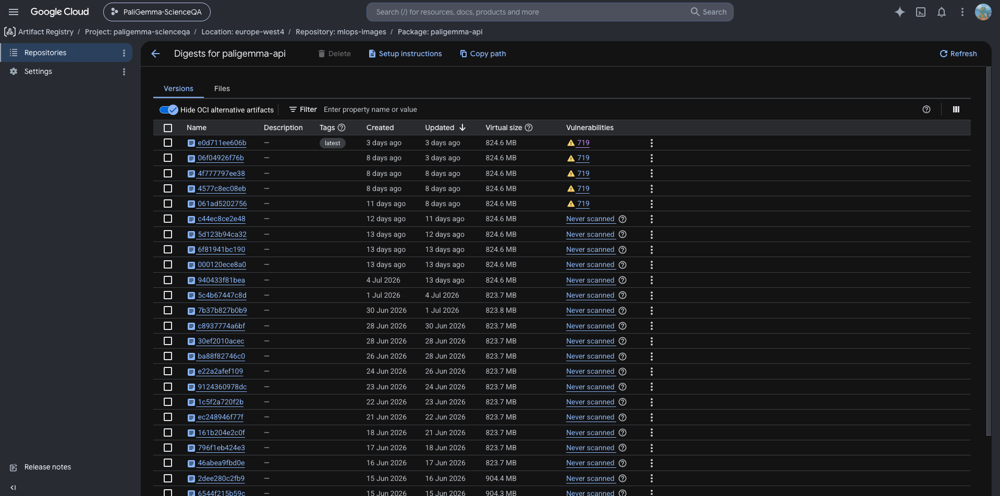
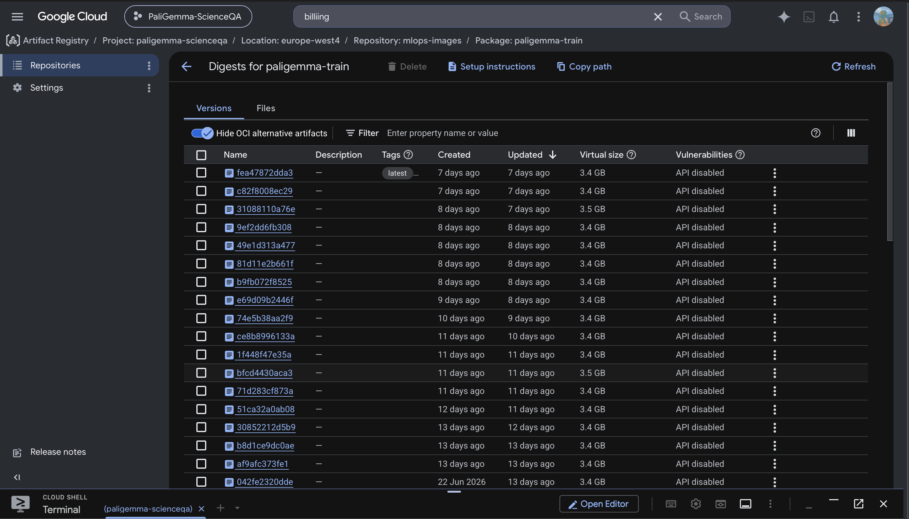
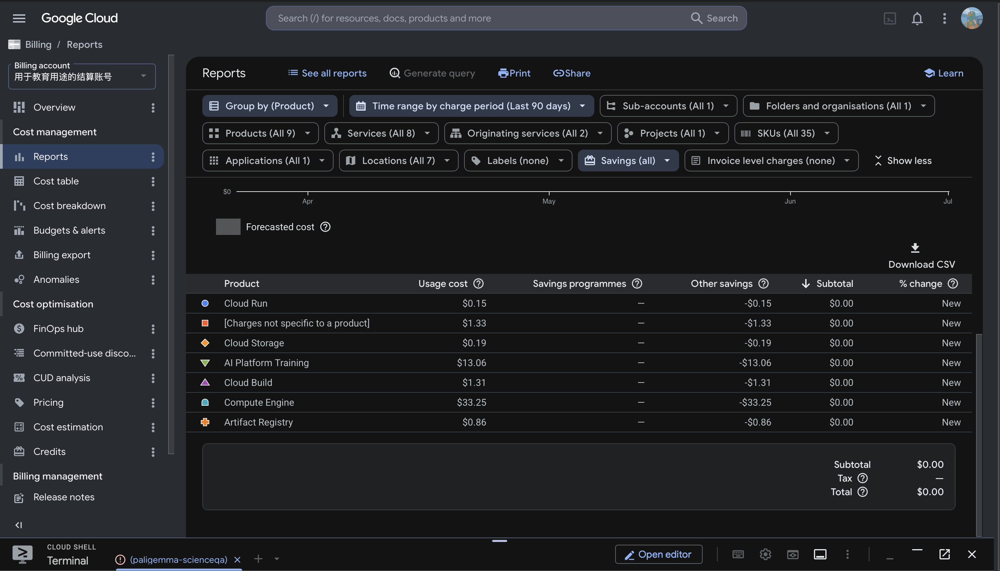
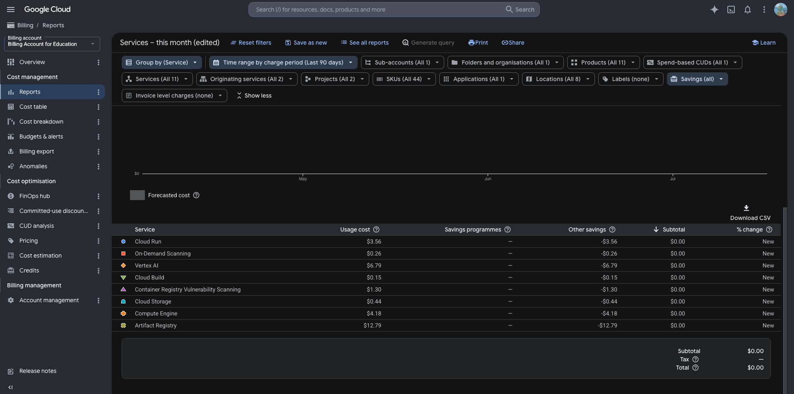

# Exam template for 02476 Machine Learning Operations

This is the report template for the exam. Please only remove the text formatted as with three dashes in front and behind
like:

```--- question 1 fill here ---```

Where you instead should add your answers. Any other changes may have unwanted consequences when your report is
auto-generated at the end of the course. For questions where you are asked to include images, start by adding the image
to the `figures` subfolder (please only use `.png`, `.jpg` or `.jpeg`) and then add the following code in your answer:

``

In addition to this markdown file, we also provide the `report.py` script that provides two utility functions:

Running:

```bash
python report.py html
```

Will generate a `.html` page of your report. After the deadline for answering this template, we will auto-scrape
everything in this `reports` folder and then use this utility to generate a `.html` page that will be your serve
as your final hand-in.

Running

```bash
python report.py check
```

Will check your answers in this template against the constraints listed for each question e.g. is your answer too
short, too long, or have you included an image when asked. For both functions to work you mustn't rename anything.
The script has two dependencies that can be installed with

```bash
pip install typer markdown
```

or

```bash
uv add typer markdown
```

## Overall project checklist

The checklist is *exhaustive* which means that it includes everything that you could do on the project included in the
curriculum in this course. Therefore, we do not expect at all that you have checked all boxes at the end of the project.
The parenthesis at the end indicates what module the bullet point is related to. Please be honest in your answers, we
will check the repositories and the code to verify your answers.

### Week 1

* [x] Create a git repository (M5)
* [x] Make sure that all team members have write access to the GitHub repository (M5)
* [x] Create a dedicated environment for you project to keep track of your packages (M2)
* [x] Create the initial file structure using cookiecutter with an appropriate template (M6)
* [x] Fill out the `data.py` file such that it downloads whatever data you need and preprocesses it (if necessary) (M6)
* [x] Add a model to `model.py` and a training procedure to `train.py` and get that running (M6)
* [x] Remember to either fill out the `requirements.txt`/`requirements_dev.txt` files or keeping your
    `pyproject.toml`/`uv.lock` up-to-date with whatever dependencies that you are using (M2+M6)
* [x] Remember to comply with good coding practices (`pep8`) while doing the project (M7)
* [x] Do a bit of code typing and remember to document essential parts of your code (M7)
* [x] Setup version control for your data or part of your data (M8)
* [x] Add command line interfaces and project commands to your code where it makes sense (M9)
* [x] Construct one or multiple docker files for your code (M10)
* [x] Build the docker files locally and make sure they work as intended (M10)
* [x] Write one or multiple configurations files for your experiments (M11)
* [x] Used Hydra to load the configurations and manage your hyperparameters (M11)
* [x] Use profiling to optimize your code (M12)
* [x] Use logging to log important events in your code (M14)
* [x] Use Weights & Biases to log training progress and other important metrics/artifacts in your code (M14)
* [x] Consider running a hyperparameter optimization sweep (M14)
* [x] Use PyTorch-lightning (if applicable) to reduce the amount of boilerplate in your code (M15)

### Week 2

* [x] Write unit tests related to the data part of your code (M16)
* [x] Write unit tests related to model construction and or model training (M16)
* [x] Calculate the code coverage (M16)
* [x] Get some continuous integration running on the GitHub repository (M17)
* [x] Add caching and multi-os/python/pytorch testing to your continuous integration (M17)
* [x] Add a linting step to your continuous integration (M17)
* [x] Add pre-commit hooks to your version control setup (M18)
* [x] Add a continues workflow that triggers when data changes (M19)
* [x] Add a continues workflow that triggers when changes to the model registry is made (M19)
* [x] Create a data storage in GCP Bucket for your data and link this with your data version control setup (M21)
* [x] Create a trigger workflow for automatically building your docker images (M21)
* [x] Get your model training in GCP using either the Engine or Vertex AI (M21)
* [x] Create a FastAPI application that can do inference using your model (M22)
* [x] Deploy your model in GCP using either Functions or Run as the backend (M23)
* [x] Write API tests for your application and setup continues integration for these (M24)
* [x] Load test your application (M24)
* [x] Create a more specialized ML-deployment API using either ONNX or BentoML, or both (M25)
* [x] Create a frontend for your API (M26)

### Week 3

* [x] Check how robust your model is towards data drifting (M27)
* [x] Setup collection of input-output data from your deployed application (M27)
* [x] Deploy to the cloud a drift detection API (M27)
* [x] Instrument your API with a couple of system metrics (M28)
* [x] Setup cloud monitoring of your instrumented application (M28)
* [x] Create one or more alert systems in GCP to alert you if your app is not behaving correctly (M28)
* [x] If applicable, optimize the performance of your data loading using distributed data loading (M29)
* [ ] If applicable, optimize the performance of your training pipeline by using distributed training (M30)
* [x] Play around with quantization, compilation and pruning for you trained models to increase inference speed (M31)

### Extra

* [x] Write some documentation for your application (M32)
* [x] Publish the documentation to GitHub Pages (M32)
* [x] Revisit your initial project description. Did the project turn out as you wanted?
* [x] Create an architectural diagram over your MLOps pipeline
* [x] Make sure all group members have an understanding about all parts of the project
* [x] Uploaded all your code to GitHub

## Group information

### Question 1
> **Enter the group number you signed up on <learn.inside.dtu.dk>**
>
> Answer:

Group A

### Question 2
> **Enter the study number for each member in the group**
>
> Example:
>
> *sXXXXXX, sXXXXXX, sXXXXXX*
>
> Answer:

Yuxin Liu 12660585
Duc-Anh Valentino Nguyen 12433139

### Question 3
> **Did you end up using any open-source frameworks/packages not covered in the course during your project? If so**
> **which did you use and how did they help you complete the project?**
>
> Recommended answer length: 0-200 words.
>
> Example:
> *We used the third-party framework ... in our project. We used functionality ... and functionality ... from the*
> *package to do ... and ... in our project*.
>
> Answer:

Yes. Besides the stack covered in the course (Transformers, Lightning, Hydra,
W&B, FastAPI, DVC, Docker), we used several additional open-source packages.
uv manages the environment and the lockfile (instead of conda/pip), and its
build backend packages our wheel. PEFT and bitsandbytes provide the
LoRA adapters and 4-bit quantization; together they made it feasible to
fine-tune and benchmark a 3B-parameter model on a single L4 GPU. Evidently
generates the data-drift reports, and prometheus-fastapi-instrumentator
exposes system metrics at `/metrics`. We used locust to load-test the
deployed API (its results changed our scaling configuration). BentoML
provides an alternative specialized serving path, Streamlit provides the demo
frontend, and Typer provides the command-line interfaces. Each of these
packages covers a need that the core stack does not. All of them are pinned
in `uv.lock`, with two deliberate exceptions: Streamlit runs isolated via
`uvx` (`streamlit==1.53.0`) because its Starlette pin conflicts with the
version FastAPI requires, and bitsandbytes is installed at runtime on the
GPU image only.

## Coding environment

> In the following section we are interested in learning more about you local development environment. This includes
> how you managed dependencies, the structure of your code and how you managed code quality.

### Question 4

> **Explain how you managed dependencies in your project? Explain the process a new team member would have to go**
> **through to get an exact copy of your environment.**
>
> Recommended answer length: 100-200 words
>
> Example:
> *We used ... for managing our dependencies. The list of dependencies was auto-generated using ... . To get a*
> *complete copy of our development environment, one would have to run the following commands*
>
> Answer:

We manage dependencies with `uv` instead of conda/pip. `pyproject.toml`
declares the dependencies and the dependency groups (`dev`, `serving`,
`monitoring`, `data`), and `uv.lock` pins the exact resolved versions;
`.python-version` pins the interpreter. CI and Docker builds use
`uv sync --frozen`/`--locked`, so the locked versions are installed exactly
and are never re-resolved.

To get an exact copy of the environment, a new team member would run:

```bash
git clone git@github.com:yuxinliu42/finetune_paligemma2_scienceqa.git
cd finetune_paligemma2_scienceqa
uv sync --locked --dev
dvc pull   # fetch the processed dataset from the GCS remote
```

`uv lock --check` verifies that the lockfile is still in sync with
`pyproject.toml` before merging. The Docker images (`dockerfiles/*.dockerfile`)
use the same `uv sync --frozen` step, so the local, CI, and container
environments are all built from the same lockfile. The dependency groups keep
heavy optional dependencies out of images that do not need them; for example,
the serving image installs only the base and the monitoring groups.

### Question 5

> **We expect that you initialized your project using the cookiecutter template. Explain the overall structure of your**
> **code. What did you fill out? Did you deviate from the template in some way?**
>
> Recommended answer length: 100-200 words
>
> Example:
> *From the cookiecutter template we have filled out the ... , ... and ... folder. We have removed the ... folder*
> *because we did not use any ... in our project. We have added an ... folder that contains ... for running our*
> *experiments.*
>
> Answer:

The project was initialized from
[SkafteNicki/mlops_template](https://github.com/SkafteNicki/mlops_template).
We filled out: `data/` (DVC-tracked pointers to the processed ScienceQA-IMG
splits); `src/scipali/`, which is split into `data/` (download + preprocess),
`models/` (model, train, evaluate, optimize, visualize), `serving/` (FastAPI
app, predict CLI, Streamlit frontend, BentoML service), and `monitoring/`
(drift detection); `configs/` (Hydra config groups); `dockerfiles/` (three
images); `tests/` (pytest suite); and `docs/` (MkDocs site, published to
GitHub Pages).

We removed `notebooks/` (all experiments were run through Hydra-configured
scripts, so we never needed notebooks) and did not use a `references/`
folder. We added two things that are not in the base template: `cloud/`
(Vertex AI + Cloud Build + ops scripts) and a `monitoring/` subpackage under
`src/scipali/`, because the template does not include a monitoring loop for
a deployed model.

### Question 6

> **Did you implement any rules for code quality and format? What about typing and documentation? Additionally,**
> **explain with your own words why these concepts matters in larger projects.**
>
> Recommended answer length: 100-200 words.
>
> Example:
> *We used ... for linting and ... for formatting. We also used ... for typing and ... for documentation. These*
> *concepts are important in larger projects because ... . For example, typing ...*
>
> Answer:

Yes. We use ruff for both linting and formatting (it replaces
black/isort/flake8 with one faster tool), mypy for static type checking,
and pre-commit hooks (`trailing-whitespace`, `end-of-file-fixer`,
`check-yaml`, `check-added-large-files`, `ruff --fix`, `ruff-format`) that run
on every commit. All three checks (ruff lint, ruff format check, mypy) are
also enforced in CI (`.github/workflows/linting.yaml`), so a non-compliant
change cannot be merged even if a hook was skipped locally. Public functions
carry type hints and short Args/Returns docstrings.

These concepts matter more as a project grows. Consistent formatting removes
a lot of friction from code review, because a reviewer can focus on the logic
instead of the style. Static typing catches a whole class of bugs before
runtime. And a shared, enforced style means that any contributor (including a
future one who was not on the original team) can read unfamiliar code without
first adapting to another author's personal conventions.

## Version control

> In the following section we are interested in how version control was used in your project during development to
> corporate and increase the quality of your code.

### Question 7

> **How many tests did you implement and what are they testing in your code?**
>
> Recommended answer length: 50-100 words.
>
> Example:
> *In total we have implemented X tests. Primarily we are testing ... and ... as these the most critical parts of our*
> *application but also ... .*
>
> Answer:

In total we implemented 137 tests across eight files. `test_model.py` (50)
covers model construction, LoRA setup, prompt building and config
resolution; `test_data.py` (24) the
download/preprocess pipeline and split integrity; `test_api.py` (24) the
serving contracts (both the JSON and the file-upload predict endpoints),
including validation failures; `test_monitoring.py` (12)
drift-feature derivation and the Evidently path; `test_optimize.py` (11)
pruning correctness, including that the achieved sparsity matches the requested
target; `test_predict.py` (8) the prediction CLI; `test_train.py` (6)
training utilities such as the √-batch learning-rate rule; and
`test_evaluate.py` (2) answer-letter extraction and scoring. All tests are
CPU-only and self-contained, so they run identically in CI.

### Question 8

> **What is the total code coverage (in percentage) of your code? If your code had a code coverage of 100% (or close**
> **to), would you still trust it to be error free? Explain you reasoning.**
>
> Recommended answer length: 100-200 words.
>
> Example:
> *The total code coverage of code is X%, which includes all our source code. We are far from 100% coverage of our **
> *code and even if we were then...*
>
> Answer:

The total coverage is **~72%** of `src/scipali` (`uv run coverage report`),
computed in CI on every push and uploaded to Codecov. CI installs the
optional monitoring extras (`--group monitoring`) so that the import-guarded
lines (the Prometheus `/metrics` instrumentation and the Evidently
drift-report body) are exercised there too, and the local number and the
Codecov badge stay in agreement.

No. 100% coverage would only mean that every line was executed at least once
during testing, not that the code is correct. It says nothing about whether
the assertions are meaningful, whether edge cases and unusual inputs are
exercised, or whether two covered lines interact incorrectly together. A test
that calls a function and checks nothing meaningful still counts as "covered."
We therefore treat coverage as a minimum signal that points at untested code,
not as a guarantee of correctness. For example, our own gaps are concentrated
in `train.py` (the GPU-only training loop, which the fast CPU unit-test suite
does not execute) and parts of `model.py`/`monitoring.py`, which are covered
by integration-level checks (a real Vertex AI run, a real drift report)
rather than by unit tests.

### Question 9

> **Did you workflow include using branches and pull requests? If yes, explain how. If not, explain how branches and**
> **pull request can help improve version control.**
>
> Recommended answer length: 100-200 words.
>
> Example:
> *We made use of both branches and PRs in our project. In our group, each member had an branch that they worked on in*
> *addition to the main branch. To merge code we ...*
>
> Answer:

Yes. Changes went into feature branches and were merged into `main` through
pull requests rather than pushed directly; the repository history shows the
PR merges. Since `main` is connected to CI (tests + linting on every
push/PR) and to automatic deployment (Cloud Build rebuilds the API image,
and later in the project a model-registry-change workflow rolls a promoted
model out to Cloud Run), a broken `main` has real consequences beyond code
review. The main practical benefit was therefore that changes stayed on a
branch until CI was green before they reached `main`, in addition to the
usual review and diff-visibility benefits of a pull request. In practice,
many documentation pushes late in the project went directly to `main` once
CI was reliably green; this was a pragmatic trade-off, and in a longer-lived
project we would enforce the rule with branch protection.

### Question 10

> **Did you use DVC for managing data in your project? If yes, then how did it improve your project to have version**
> **control of your data. If no, explain a case where it would be beneficial to have version control of your data.**
>
> Recommended answer length: 100-200 words.
>
> Example:
> *We did make use of DVC in the following way: ... . In the end it helped us in ... for controlling ... part of our*
> *pipeline*
>
> Answer:

Yes. DVC tracks the processed ScienceQA-IMG splits, with a GCS remote
(`gs://mlops-paligemma-west4/dvcstore`). `.dvc/config` sets `no_scm=true`
because the training/optimize Docker images ship the `.dvc` pointer files
without a `.git` directory (so DVC cannot detect a git repo inside the
container), and `dvc pull` needs to work in that no-SCM mode.

DVC let us keep the large, binary image data completely out of git while
still versioning exactly which processed split a given training run used: the
pointer files are small and give readable diffs in git, while the actual data
is stored in GCS and pulled on demand (locally, in CI, and inside Vertex AI
training jobs). It also meant that switching data sources in the middle of
the project (we initially targeted `lmms-lab/ScienceQA`, then switched to
[`derek-thomas/ScienceQA`](https://huggingface.co/datasets/derek-thomas/ScienceQA)
because the former provides no train split) needed no special handling:
`dvc add` + `dvc push`, and the new processed split was versioned in the
same way.

### Question 11

> **Discuss you continuous integration setup. What kind of continuous integration are you running (unittesting,**
> **linting, etc.)? Do you test multiple operating systems, Python  version etc. Do you make use of caching? Feel free**
> **to insert a link to one of your GitHub actions workflow.**
>
> Recommended answer length: 200-300 words.
>
> Example:
> *We have organized our continuous integration into 3 separate files: one for doing ..., one for running ... testing*
> *and one for running ... . In particular for our ..., we used ... .An example of a triggered workflow can be seen*
> *here: <weblink>*
>
> Answer:

CI is split across several GitHub Actions workflows:

- `tests.yaml`: runs `pytest` + `coverage` across a 3 × 2 matrix
  (`ubuntu-latest` / `windows-latest` / `macos-latest` × Python `3.11` /
  `3.12`, six combinations in total), using `astral-sh/setup-uv` with
  `enable-cache: true` for dependency caching. Coverage is uploaded to Codecov
  from the ubuntu/3.11 cell.
- `linting.yaml`: `ruff check`, `ruff format --check`, and `mypy`, run on
  every push/PR to `main`.
- `docs.yaml`: builds and publishes the MkDocs site to GitHub Pages
  (`mkdocs gh-deploy`) on changes to `docs/`/`src/`.
- `data-change.yaml` and `model-registry-change.yaml`: two additional
  continuous workflows. The first runs data-integrity checks when the DVC
  pointer files change; the second reacts to a real Weights & Biases webhook
  when the `production` model alias is moved, and automatically rolls the
  newly promoted adapter out to Cloud Run and smoke-tests the live endpoint.

We test this matrix because path handling and multiprocessing differ across
operating systems, which also forces the suite to stay CPU-only and
self-contained. We deliberately do not test several PyTorch versions:
`uv.lock` pins exactly one, and testing versions that we never ship would
validate configurations that can never reach production. Dependency caching
via `astral-sh/setup-uv` keeps a full six-cell matrix run down to a few
minutes. Together with the Cloud Build trigger that rebuilds (and
import-checks) the API image, one push to `main` is validated on six
environments and produces a deployable artifact without any manual steps.

Example: <https://github.com/yuxinliu42/finetune_paligemma2_scienceqa/actions/workflows/tests.yaml>

## Running code and tracking experiments

> In the following section we are interested in learning more about the experimental setup for running your code and
> especially the reproducibility of your experiments.

### Question 12

> **How did you configure experiments? Did you make use of config files? Explain with coding examples of how you would**
> **run a experiment.**
>
> Recommended answer length: 50-100 words.
>
> Example:
> *We used a simple argparser, that worked in the following way: Python  my_script.py --lr 1e-3 --batch_size 25*
>
> Answer:

We used Hydra configs under `configs/` (`data/`, `model/`, `trainer/`,
`sweep/` groups), which are composed at runtime by the `train` entry point.
Any nested key can be overridden from the CLI, e.g.:

```bash
uv run train trainer.wandb.enabled=true trainer.wandb.run_name=local-test \
  model.lora_r=16 data.batch_size=4 trainer.accumulate_grad_batches=4
```

The learning rate is derived from `model.base_learning_rate` via a
√-batch-size rule unless it is overridden explicitly, so that trials with
different gradient-accumulation settings are compared at an equivalent
effective learning rate.

### Question 13

> **Reproducibility of experiments are important. Related to the last question, how did you secure that no information**
> **is lost when running experiments and that your experiments are reproducible?**
>
> Recommended answer length: 100-200 words.
>
> Example:
> *We made use of config files. Whenever an experiment is run the following happens: ... . To reproduce an experiment*
> *one would have to do ...*
>
> Answer:

Every run logs its fully resolved Hydra config to Weights & Biases as part of
the run's config, so the exact hyperparameters behind any result can always
be recovered from the W&B run page and do not depend on whatever config file
existed locally at the time. Dependency versions are pinned via `uv.lock`
(`--frozen` installs in CI/Docker/Vertex), so package drift cannot silently
change results between runs. A seed is set for the training run, and the
produced LoRA adapter, its evaluation metrics, and the W&B run config are
stored together (the adapter is uploaded as a W&B artifact and can be
downloaded again together with the config that produced it). To reproduce a
specific result: pull the same DVC data revision, take the hyperparameters
from the corresponding W&B run, and re-run `uv run train` with the same Hydra
overrides.

### Question 14

> **Upload 1 to 3 screenshots that show the experiments that you have done in W&B (or another experiment tracking**
> **service of your choice). This may include loss graphs, logged images, hyperparameter sweeps etc. You can take**
> **inspiration from [this figure](figures/wandb.png). Explain what metrics you are tracking and why they are**
> **important.**
>
> Recommended answer length: 200-300 words + 1 to 3 screenshots.
>
> Example:
> *As seen in the first image when have tracked ... and ... which both inform us about ... in our experiments.*
> *As seen in the second image we are also tracking ... and ...*
>
> Answer:


The first screenshot shows the full-data r=16 sweep (`win9arpw`): per-trial
generation-based `val/accuracy` together with `val/loss`, where the
disagreement between the two metrics is directly visible; the second shows
the earlier r=8 sweep (`xptwdnis`) with the same effect. Beyond these curves,
every run logs its fully resolved Hydra config (the exact hyperparameters
behind any result), a table of 32 sampled test predictions for qualitative
inspection, and the trained LoRA adapter as a W&B artifact, so the model of
any run and the config that produced it can be recovered together from the
dashboard, even months later.

We track both `val/loss` and a generation-based `val/accuracy` (exact match
on the extracted answer letter) every epoch, and we select checkpoints and
early-stop on `val/accuracy` rather than on `val/loss`. This choice mattered
in practice: in our sweep, the trial with the *best* `val/loss` (0.464) had
the *worst* `val/accuracy` (0.619), while the trial we actually selected
(best `val/accuracy`, promoted to production at the time with 64.1% test
accuracy) had a *higher* loss (0.511) but the *best* accuracy (0.702); see
[`reports/RESULTS.md`](RESULTS.md#methodology-note-why-we-optimise-valaccuracy-not-valloss)
for the full table. Since the task is graded on exact-match accuracy and not
on log-likelihood, optimising the metric that is actually reported prevented
us from promoting a model that looked good on loss but was measurably worse
on the metric we care about.

### Question 15

> **Docker is an important tool for creating containerized applications. Explain how you used docker in your**
> **experiments/project? Include how you would run your docker images and include a link to one of your docker files.**
>
> Recommended answer length: 100-200 words.
>
> Example:
> *For our project we developed several images: one for training, inference and deployment. For example to run the*
> *training docker image: `docker run trainer:latest lr=1e-3 batch_size=64`. Link to docker file: <weblink>*
>
> Answer:

We built three images (`dockerfiles/`): `train.dockerfile` (CUDA/amd64, used
for Vertex AI training/eval/optimize jobs; it installs the project from a
prebuilt wheel instead of building it inside the image, and the comment in
the Dockerfile explains why), `api.dockerfile` (CPU, the FastAPI serving
image deployed to Cloud Run), and `predict.dockerfile` (CPU, a standalone
single-prediction CLI image). The API image is rebuilt in the cloud on every
push (Cloud Build trigger `mlops-ci-api`); the train image is built manually
with Cloud Build (it needs the locally built wheel injected into the build
context); and all three were also built and smoke-tested locally via
`inv docker-build`.

Example: running the predict image (the adapter and the input image are
mounted in, and the gated base model needs a Hugging Face token):

```bash
docker run --rm -v "$(pwd)/checkpoints:/checkpoints" -v "$(pwd)/img.png:/img.png" \
  -e HF_TOKEN=<token> predict:latest /checkpoints/adapter-production \
  -q "What gas do plants absorb?" -c "oxygen,carbon dioxide,nitrogen" -i /img.png
```

Link: [`dockerfiles/api.dockerfile`](https://github.com/yuxinliu42/finetune_paligemma2_scienceqa/blob/main/dockerfiles/api.dockerfile)

### Question 16

> **When running into bugs while trying to run your experiments, how did you perform debugging? Additionally, did you**
> **try to profile your code or do you think it is already perfect?**
>
> Recommended answer length: 100-200 words.
>
> Example:
> *Debugging method was dependent on group member. Some just used ... and others used ... . We did a single profiling*
> *run of our main code at some point that showed ...*
>
> Answer:

Debugging was a mix of the VS Code debugger, logging, and, for the harder
bugs, inspecting intermediate tensors and logs. Two concrete examples:
(1) the training loss was stuck early in the project because of a stale
`subjects`/`max_length` handling bug in the data pipeline; (2) a prompt that
put the Hint/Lecture text *before* the answer Choices silently truncated the
choices once the token limit was reached, which cost roughly **16 points** of
test accuracy; we traced it by inspecting the actual tokenized prompts and
fixed it by reordering `build_prompt`.

We profiled in two ways: PyTorch Lightning's built-in profiler
(`trainer.profiler`, configurable via Hydra) for the training loop, and a
`cProfile`-based script (`scipali.data.profile_data`) for the `DataLoader`.
The latter showed that loading is dominated by image decoding (~45% PIL
decode, ~28% resize) but is not the bottleneck, because ~11 ms/batch fully
overlaps with the GPU compute (see `reports/profiling/`). So the code was not
perfect, but profiling showed us which inefficiency would matter and that we
did not need to fix it yet.

## Working in the cloud

> In the following section we would like to know more about your experience when developing in the cloud.

### Question 17

> **List all the GCP services that you made use of in your project and shortly explain what each service does?**
>
> Recommended answer length: 50-200 words.
>
> Example:
> *We used the following two services: Engine and Bucket. Engine is used for... and Bucket is used for...*
>
> Answer:

- Cloud Storage (GCS): the DVC remote for versioned data, the model
  registry's artifact store (`models/production/`), and the drift-monitoring
  reference/production tables.
- Vertex AI: runs all GPU work as custom jobs (training, hyperparameter
  sweeps, standalone evaluation, quantization/pruning) on single-L4 machines.
- Cloud Build: builds the Docker images; a trigger rebuilds the API image
  automatically on every push to `main`.
- Artifact Registry: stores the built container images.
- Cloud Run: serves the FastAPI inference app (CPU-only, scale-to-zero,
  lazy model loading).
- Secret Manager: holds the Hugging Face token and the W&B API key, which
  are fetched at container start instead of being stored inside the images.
- Cloud Monitoring: an alert policy on repeated 5xx responses, with a
  verified email notification channel.
- IAM / Workload Identity Federation: keyless GCP authentication for the
  GitHub Actions workflow that rolls a newly promoted model out to Cloud Run.

### Question 18

> **The backbone of GCP is the Compute engine. Explained how you made use of this service and what type of VMs**
> **you used?**
>
> Recommended answer length: 100-200 words.
>
> Example:
> *We used the compute engine to run our ... . We used instances with the following hardware: ... and we started the*
> *using a custom container: ...*
>
> Answer:

We did not provision or manage Compute Engine VMs directly. All GPU work runs
as Vertex AI custom jobs, which provision the underlying VM for us
(`g2-standard-8`: 8 vCPU / 32 GB RAM / 1× NVIDIA L4, via the Flex Start queue,
in `europe-west4`, the only region where we had both G2 machine availability
and L4 quota). Serving uses Cloud Run instead of a manually managed VM. So
our use of Compute Engine is indirect, through the managed services built on
top of it, and this was a deliberate choice: we did not need raw VM control
for training or for serving, and the queue-based Flex Start provisioning
meant that we never paid for an idle GPU.

### Question 19

> **Insert 1-2 images of your GCP bucket, such that we can see what data you have stored in it.**
> **You can take inspiration from [this figure](figures/bucket.png).**
>
> Answer:


This can be verified from the CLI:

```bash
$ gsutil ls gs://mlops-paligemma-west4/
gs://mlops-paligemma-west4/dvcstore/
gs://mlops-paligemma-west4/models/
gs://mlops-paligemma-west4/monitoring/
gs://mlops-paligemma-west4/vertex-output/
```

`dvcstore/` holds the DVC-versioned ScienceQA-IMG splits, `models/` holds the
LoRA adapters (with `models/production/` being the one the API serves),
`monitoring/` holds the drift reference/production tables, and
`vertex-output/` holds Vertex AI job outputs. Total bucket size: ~14.2 GiB.

### Question 20

> **Upload 1-2 images of your GCP artifact registry, such that we can see the different docker images that you have**
> **stored. You can take inspiration from [this figure](figures/registry.png).**
>
> Answer:





This can be verified from the CLI:

```bash
gcloud artifacts docker images list \
  europe-west4-docker.pkg.dev/paligemma-scienceqa/mlops-images
```

### Question 21

> **Upload 1-2 images of your GCP cloud build history, so we can see the history of the images that have been build in**
> **your project. You can take inspiration from [this figure](figures/build.png).**
>
> Answer:


This can be verified from the CLI:

```bash
gcloud builds list --region=europe-west4
```

The trigger `mlops-ci-api` builds the API image automatically on every push
to `main` that touches `src/scipali/**`; the train image's trigger
(`mlops-ci-train`) exists but is disabled, because that image needs a locally
built wheel injected into the build context (see Question 15), so it is built
manually rather than from a bare git checkout.

The build history also shows several **FAILURE** builds, and these are
intentional: a toolchain drift in the base image started to produce images
that built successfully but could not import the application (we only
noticed this when a Cloud Run deploy failed), so we added an import
smoke-test step to `cloudbuild.api.yaml`. Broken images now fail in CI with a
one-line reason and are never pushed; the builds kept failing until the base
image recovered, and the guard still checks every push. The live service was
not affected at any point: Cloud Run kept the traffic on the last healthy
revision, and deploys were pinned to a known-good image digest in the
meantime.

### Question 22

> **Did you manage to train your model in the cloud using either the Engine or Vertex AI? If yes, explain how you did**
> **it. If not, describe why.**
>
> Recommended answer length: 100-200 words.
>
> Example:
> *We managed to train our model in the cloud using the Engine. We did this by ... . The reason we choose the Engine*
> *was because ...*
>
> Answer:

Yes. Every GPU workload trains as a Vertex AI custom job; we deliberately did
not provision any Compute Engine VMs (there is nothing to SSH into or to
forget to delete; `gcloud compute instances list` is empty by design). A job
is one template (`cloud/vertex_config.template.yaml`) rendered with
`envsubst` and submitted via `gcloud ai custom-jobs create`, wrapped by
`cloud/watch_job.sh` (image digest-pinning, retries, log streaming). The
container is our train image from Artifact Registry; at startup it fetches
the W&B/HF secrets from Secret Manager, runs `dvc pull` for the processed
data, and then executes baseline training, a W&B Bayesian sweep
(`wandb sweep` + `wandb agent`), and evaluation of the best trial. The
hardware is a single NVIDIA L4 (`g2-standard-8`) in `europe-west4`, the only
region where we had both G2 availability and L4 quota, reached through the
Flex Start queue, where the waiting time for capacity ranged from 8 minutes
to more than 16 hours, and `maxWaitDuration` had to be raised explicitly so
that jobs were not cancelled during long capacity shortages.

## Deployment

### Question 23

> **Did you manage to write an API for your model? If yes, explain how you did it and if you did anything special. If**
> **not, explain how you would do it.**
>
> Recommended answer length: 100-200 words.
>
> Example:
> *We did manage to write an API for our model. We used FastAPI to do this. We did this by ... . We also added ...*
> *to the API to make it more ...*
>
> Answer:

Yes, a FastAPI application (`scipali.serving.api`). `POST /predict`
takes a Pydantic-validated JSON body (`question`, `choices`, optional
`hint`/`lecture`, and a base64-encoded `image_b64`) and returns
`{"prediction": "<letter>"}`; `POST /predict-file` is its multipart twin that
accepts a direct file upload (for browser demos in the Swagger UI); `GET /`
reports health and whether the model is
loaded; `GET /monitor/drift` and `GET /metrics` expose monitoring. Two design
decisions are the most important ones: lazy model loading (the app starts and
passes its startup probes in seconds and loads the 3B model on the first
prediction, which is required for Cloud Run), and reading the adapter from a
`gs://` path at startup, which decouples model updates from the container
image. Every prediction also emits one structured JSON log line (derived
features + prediction) that feeds the drift-monitoring pipeline. FastAPI
serves interactive OpenAPI docs at `/docs` automatically, and we use them for
live demos; the full contracts and the request-flow diagram are documented in
`docs/source/api.md`.

### Question 24

> **Did you manage to deploy your API, either in locally or cloud? If not, describe why. If yes, describe how and**
> **preferably how you invoke your deployed service?**
>
> Recommended answer length: 100-200 words.
>
> Example:
> *For deployment we wrapped our model into application using ... . We first tried locally serving the model, which*
> *worked. Afterwards we deployed it in the cloud, using ... . To invoke the service an user would call*
> *`curl -X POST -F "file=@file.json"<weburl>`*
>
> Answer:

Yes, both locally and in the cloud. The FastAPI app is deployed to Cloud
Run (`paligemma-api`, `europe-west4`): CPU-only (8 vCPU / 32 GB),
scale-to-zero, `concurrency 1` (one heavy 3B inference per container) with
overflow to at most 3 instances; these capacity settings came from the load
testing (Question 25). Lazy model loading lets the container pass its startup
probe immediately; the adapter is read from `gs://…/models/production` at
startup, so promoting a new model needs no rebuild and no redeploy. The
service can be invoked directly:

```bash
curl -X POST https://paligemma-api-581237630637.europe-west4.run.app/predict \
  -H 'Content-Type: application/json' \
  -d '{"question": "...", "choices": ["a","b","c"], "image_b64": "<base64>"}'
```

A cold (scaled-to-zero) `/predict` takes about 150 to 230 s in total
(container start + model load + inference); warm calls take about 25 to 80 s.
A Streamlit frontend and a shell demo (`cloud/demo_api.sh`) call the same
live endpoint.


### Question 25

> **Did you perform any functional testing and load testing of your API? If yes, explain how you did it and what**
> **results for the load testing did you get. If not, explain how you would do it.**
>
> Recommended answer length: 100-200 words.
>
> Example:
> *For functional testing we used pytest with httpx to test our API endpoints and ensure they returned the correct*
> *responses. For load testing we used locust with 100 concurrent users. The results of the load testing showed that*
> *our API could handle approximately 500 requests per second before the service crashed.*
>
> Answer:

Yes, both. **Functional tests**: 24 tests in `tests/test_api.py` call the
app through FastAPI's `TestClient` (the health contract, the `/predict` and
`/predict-file` success paths and validation failures with 422 on malformed
bodies, the drift endpoint, and the metrics instrumentation) and run in CI
on every push across the 3 OS × 2 Python matrix. **Load testing**: locust against the
deployed service (`tests/load/locustfile.py`; the recorded run and its
analysis are in `reports/load/`). Warm `/predict` showed p50 ≈ 10 s /
p95 ≈ 27 s, and under concurrent users the initial deployment returned 429s
because it served one request at a time; this finding directly changed the
production settings (`max-instances` raised from 1 to 3, while
`concurrency 1` was kept deliberately: one heavy inference per container
avoids memory pressure). A later test also produced 500s under concurrent
cold starts, which our 5xx alert caught and reported by email within minutes
(Question 26).

### Question 26

> **Did you manage to implement monitoring of your deployed model? If yes, explain how it works. If not, explain how**
> **monitoring would help the longevity of your application.**
>
> Recommended answer length: 100-200 words.
>
> Example:
> *We did not manage to implement monitoring. We would like to have monitoring implemented such that over time we could*
> *measure ... and ... that would inform us about this ... behaviour of our application.*
>
> Answer:

Yes, three layers. **Data drift**: `monitoring.py` derives lightweight
features per request (question length, number of choices, hint/lecture
presence, image dimensions); `GET /monitor/drift` compares the training
reference against production features collected from real `/predict` traffic
via Cloud Logging (Evidently `DataDriftPreset`); this avoids the
self-comparison problem of checking the reference against a held-out slice
of the same dataset. **System metrics**: `prometheus-fastapi-instrumentator`
exposes request counts/latency/sizes at `/metrics`. **Alerting**: a Cloud
Monitoring policy fires on any 5xx within 5 minutes and emails a notification
channel that we verified end-to-end (`verificationStatus: VERIFIED`) instead
of assuming that delivery works. The alert has also fired in a real case:
during a load test, two `/predict` requests returned 500 under concurrent
cold starts; the incident was opened and an email arrived within minutes,
and then it resolved automatically. The zero threshold is deliberate because
our baseline traffic is near zero (a single server error is already the
signal); with more traffic we would change it to an error-rate condition.

## Overall discussion of project

> In the following section we would like you to think about the general structure of your project.

### Question 27

> **How many credits did you end up using during the project and what service was most expensive? In general what do**
> **you think about working in the cloud?**
>
> Recommended answer length: 100-200 words.
>
> Example:
> *Group member 1 used ..., Group member 2 used ..., in total ... credits was spend during development. The service*
> *costing the most was ... due to ... . Working in the cloud was ...*
>
> Answer:

The total usage across the project's two education billing accounts was
**≈ $80**, fully covered by credits ($0 paid by us). The first account from Yuxin Liu
accrued $50.15 (Compute Engine $33.25 + AI Platform Training $13.06, which
together form the Vertex L4 training stack, because the GPU VMs are billed
as Compute Engine SKUs under the job orchestration, plus small Cloud Build /
Artifact Registry / Storage / Cloud Run charges) and closed in the middle of
the project, during a running sweep; the project was then re-linked to a
second account from Duc-Anh Valentino Nguyen, which accrued $29.47 (Vertex + Compute $10.97, Artifact
Registry $12.79 for the stored train images, Cloud Run $3.56, and the rest
went to scanning, storage, and builds). The most expensive service was
therefore the **Vertex AI training stack** (≈ $57 of ≈ $80), which is
consistent with 73 custom jobs and ~47 h of billed GPU runtime; the
Flex-Start queue waiting time was not billed. Storage, builds, and
scale-to-zero serving added only a few dollars in total.





### Question 28

> **Did you implement anything extra in your project that is not covered by other questions? Maybe you implemented**
> **a frontend for your API, use extra version control features, a drift detection service, a kubernetes cluster etc.**
> **If yes, explain what you did and why.**
>
> Recommended answer length: 0-200 words.
>
> Example:
> *We implemented a frontend for our API. We did this because we wanted to show the user ... . The frontend was*
> *implemented using ...*
>
> Answer:

Yes, several things that the questions above do not cover. **An
inference-optimization suite**: a bf16 vs int4 vs `torch.compile` benchmark
(int4 halves the GPU memory for a ~9 % latency cost), a global-magnitude
pruning sweep over the full test split (graceful degradation up to ~30 %
sparsity, collapse at 70 %), and a masked prune-finetune that recovers
~1 pt at 50 % sparsity, all run as Vertex jobs with the results in
`reports/RESULTS.md`. **Automated model rollout**: moving the `production`
alias in the W&B model registry fires a webhook, which triggers a
`repository_dispatch` GitHub Actions workflow (keyless Workload Identity
Federation) that rolls out a fresh Cloud Run revision and smoke-tests it; we
verified this rollout live. **A CI import guard**, added after a real
incident: a base-image drift produced images that built successfully but
could not import the application; Cloud Build now runs an import smoke test,
so broken images fail in CI and are never pushed. We also added a two-mode
Streamlit frontend, a BentoML serving alternative, and a detailed command
guide (`COMMANDS.md`, linked from the README) with real expected outputs.

### Question 29

> **Include a figure that describes the overall architecture of your system and what services that you make use of.**
> **You can take inspiration from [this figure](figures/overview.png). Additionally, in your own words, explain the**
> **overall steps in figure.**
>
> Recommended answer length: 200-400 words
>
> Example:
>
> *The starting point of the diagram is our local setup, where we integrated ... and ... and ... into our code.*
> *Whenever we commit code and push to GitHub, it auto triggers ... and ... . From there the diagram shows ...*
>
> Answer:


**Figure: System architecture.** End-to-end MLOps pipeline for fine-tuning and
serving PaliGemma2-3B on ScienceQA-IMG. Solid arrows show the main artifact
flow from data versioning to monitoring; dashed arrows mark the two automated
feedback loops: (A) the auto-deploy loop triggered by model promotion, and (B)
the drift feedback loop from production logs back to the serving service.

The pipeline begins with data versioning. The ScienceQA-IMG dataset is
preprocessed and versioned with DVC, with the data itself stored in a GCS
bucket while git tracks only the pointer files. Training runs as a one-shot
Vertex AI custom job on a single L4 GPU, taking two parallel inputs: Hydra
configuration files and the DVC-pulled dataset. We fine-tune PaliGemma2-3B
using LoRA, keeping the entire 3B-parameter base model frozen and training only
a low-rank adapter (~0.2% of total parameters), which is shown in the figure
as a frozen block with a small trainable part.

All runs are tracked in Weights & Biases. A Bayesian sweep optimizes
val/accuracy rather than val/loss, a choice motivated by the observed
disagreement between the two metrics across sweep trials. The winning
configuration reaches 72.19% test accuracy and is promoted by moving the
production alias in the W&B model registry. Promotion is a single event with
two consequences: the alias change fires a webhook, and the promoted adapter
artifact is stored in GCS under models/production.

To keep the figure readable, several details are simplified. The link from
Cloud Logging to the drift check summarizes a three-step chain: a collect command
reads prediction events back from Cloud Logging, derives the same feature set
used for the training reference, and writes a production CSV to GCS, which the
/monitor/drift endpoint then compares against the reference on demand.
The container-image flow is also
omitted: Cloud Build builds the serving image on every push, while the training
image is built manually from a locally-built wheel (its CI trigger is
deliberately disabled), and both Vertex AI jobs and Cloud Run pull images by
digest, so each workload runs exactly the image that was built and verified.
Finally, the figure does not show the human step in the loop: merging code
changes triggers automatic validation but not automatic retraining, because
retraining stays a deliberate human decision due to GPU cost and quota; only
the rollout after promotion is automated (via keyless Workload Identity
Federation rather than stored service-account keys).

### Question 30

> **Discuss the overall struggles of the project. Where did you spend most time and what did you do to overcome these**
> **challenges?**
>
> Recommended answer length: 200-400 words.
>
> Example:
> *The biggest challenges in the project was using ... tool to do ... . The reason for this was ...*
>
> Answer:

The single biggest accuracy bug was a prompt-ordering mistake: placing the
optional Hint/Lecture text before the answer Choices meant the tokenizer's
`max_length` sometimes truncated the choices themselves. This cost
roughly **16 points** of test accuracy until it was diagnosed and fixed by
reordering the prompt builder.

**Vertex AI GPU availability** cost us a lot of time: L4 quota and G2 machine
availability only matched in `europe-west4` (another region had quota but no
G2 machines at all), and Flex Start's default `maxWaitDuration` silently
resulted in a 24-hour cutoff during stockouts unless it was explicitly
overridden. A GCP billing account also closed in the middle of a sweep, which
killed several running trials; we treated the runs that W&B marked as
"failed" (but that actually completed) as valid, since their artifacts were
intact.

**The pruning sweep** failed repeatedly on Vertex before it worked: capacity
errors, a CUDA out-of-memory during pruning, a packaging bug that dropped
subpackages from a wheel built inside the image (fixed by building the wheel
outside the image and copying it in), and a host-RAM out-of-memory caused by
naively collecting all ~3B weights as float32 (fixed with a histogram-based
global threshold instead).

One bug appeared only in production: Rich's fixed-width log wrapping split
the drift-monitoring JSON payload over several lines once it reached Cloud
Logging, which silently broke the collect → drift loop. We fixed it by
logging structured JSON directly to stdout instead of through the Rich
logger. Separately, a GCP organization policy that disables service-account
key creation forced us to redesign the authentication of the
model-registry-change CI workflow around keyless Workload Identity
Federation in the middle of the project. Finally, on the
development-environment side, the project's working directory was synced by
iCloud, so files were sometimes evicted in the middle of an operation, which
intermittently stalled `git diff`, `gcloud builds submit`, and even local
`docker build`; at first these problems looked like tool bugs, until we
traced them back to the sync behaviour.

### Question 31

> **State the individual contributions of each team member. This is required information from DTU, because we need to**
> **make sure all members contributed actively to the project. Additionally, state if/how you have used generative AI**
> **tools in your project.**
>
> Recommended answer length: 50-300 words.
>
> Example:
> *Student sXXXXXX was in charge of developing of setting up the initial cookie cutter project and developing of the*
> *docker containers for training our applications.*
> *Student sXXXXXX was in charge of training our models in the cloud and deploying them afterwards.*
> *All members contributed to code by...*
> *We have used ChatGPT to help debug our code. Additionally, we used GitHub Copilot to help write some of our code.*
> Answer:

**Duc-Anh Valentino Nguyen** set up  the initial repository scaffold (the cookiecutter-based initial commit) and
early iterations of the project README (framework overview, team-member
listing). **Yuxin Liu** implemented the data pipeline and the DVC setup, the
model/training code and Hydra configs, the Vertex AI training/sweep/
evaluation/optimization jobs, the FastAPI serving app, the Streamlit frontend
and the BentoML service, the CI/CD workflows (tests, linting, docs, and the
two continuous data/model-registry-triggered workflows), the Cloud Run
deployment, the drift-monitoring and Cloud Monitoring alerting setup, the
documentation site, and this results write-up. This split is directly
visible in the history: the large majority of commits on `main` are under
Yuxin Liu's git identities, and the remainder under Duc-Anh Valentino
Nguyen; this can be verified at any time with `git shortlog -sn main`.
