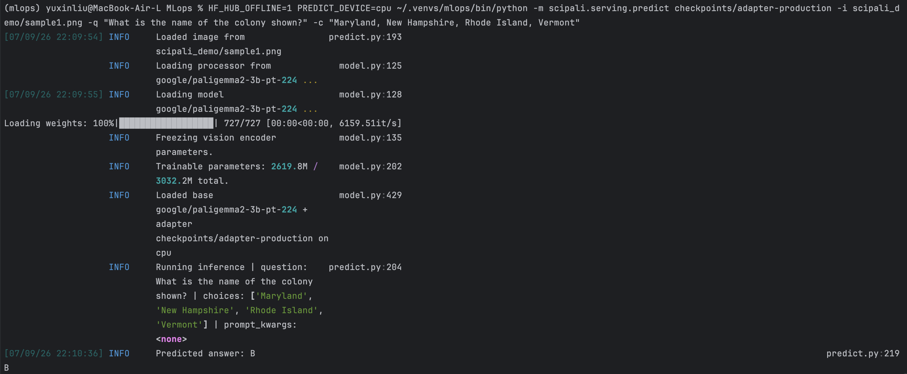
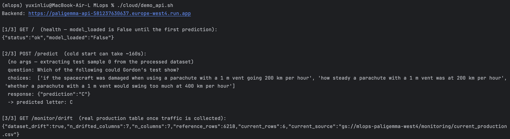
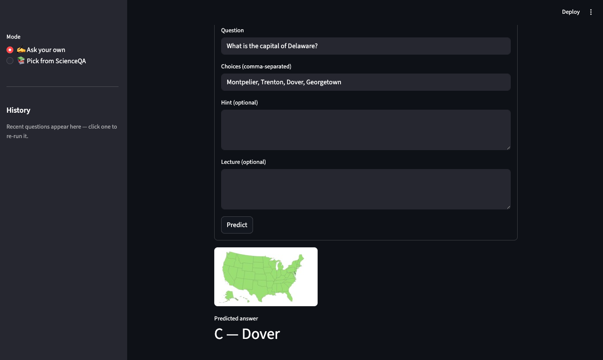
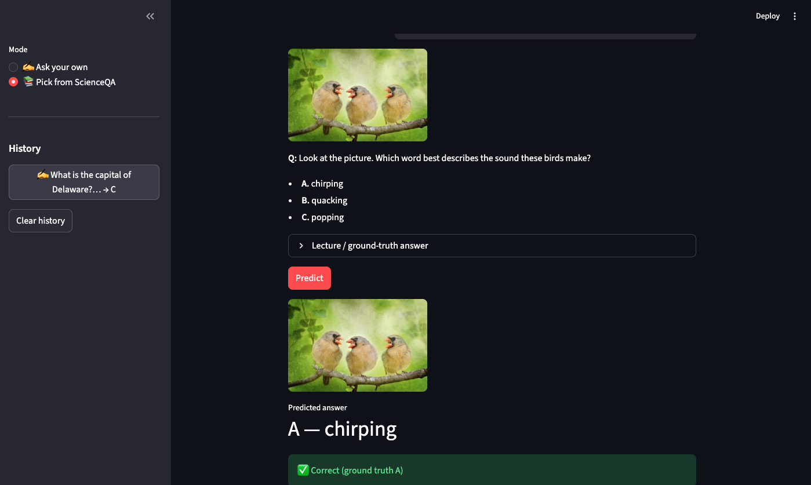

# Results — [PaliGemma2-3B](https://huggingface.co/google/paligemma2-3b-pt-224) fine-tuned on [ScienceQA](https://huggingface.co/datasets/derek-thomas/ScienceQA) (image subset)

> The full-data r=16 retrain completed (job
> `3661126192938876928`, ~28.7 h, all 8 sweep trials). The winner
> **`sandy-sweep-7` — test 72.19% (1456/2017)** — is now **promoted to
> production** (GCS `models/production/` + W&B `:production` v16). All key adapters are backed up at
> `~/mlops-adapter-backup/`.

Self-contained results summary backing the exam report (`reports/README.md`).
All numbers are exact-match accuracy of the generated answer **letter** on the
held-out ScienceQA-IMG test split (2017 samples).

**Pipeline.** The end-to-end MLOps pipeline that produced these numbers — data
versioning, training, evaluation, model registry, serving, drift monitoring, and
the inference optimization reported below — is diagrammed in
[`figures/architecture.jpg`](figures/architecture.jpg).

**Answer matching.** Accuracy is exact match on the *extracted answer letter*:
we take the first letter of the model's greedy generation — tolerating the rare
wrapped or repeated outputs greedy decoding can emit (`(A)`, `A.`, `AA`) — and
compare it against the gold letter. This is more robust than full-string
equality, which would score a stray token as wrong even when the chosen letter
is right. On the archived `sandy-sweep-7` test run the hardened matcher changes
exactly **one** of 2017 predictions (a single `AA`→`A`): 72.19% (1456/2017)
strict vs 72.24% (1457/2017) hardened. We report the strict **72.19%** from the
archived run; `extract_answer_letter` is what the current `evaluate.py` and
serving path use going forward, so the headline is robust either way.

## Headline

| Model | Data | LoRA | Test accuracy | Status |
|---|---|---|---|---|
| Pre-fix baseline | old | r=8 | 42.9% | prompt truncated the choices |
| Sweep #1 winner | old | r=8 | 58.85% | prompt fix; `base_lr` 1e-4 |
| `vague-sweep-3` (sweep #2 winner) | old (1,677) | r=8 | 64.1% (1293/2017) | previous production |
| **`sandy-sweep-7`** (full-data retrain winner) | **full (6,218)** | **r=16** | **72.19%** (1456/2017) | **deployed production** (W&B v16) |

(2nd-best full-data trial: `autumn-sweep-2`, 71.3% — two trials at lr ≈ 1.33e-4
both landing near ~72% indicates a robust optimum, not noise.)

Headline finding: **fixing the data pipeline (1,677 → 6,218 train examples) +
raising LoRA rank (8 → 16) lifted test accuracy 64.1% → 72.19% (+8.1 pts)** on the
same 2017-sample test set, with the gains in the image-heavy subjects (natural
+7.6, social +9.1). 80%+ would need higher resolution (448) / unfreezing the
vision encoder / chain-of-thought — not attempted here.

By topic (`accuracy_by_topic.png`, topics with ≥20 test samples), the
per-subject view masks a wide *within-subject* spread: in natural science,
biology (74.7%) and physics (68.7%) far outrun **chemistry (48.9%) and
earth-science (54.5%)** — the genuine weak spots, and clearer improvement
targets than the subject average.

The deployed adapter is now `sandy-sweep-7` at
`gs://mlops-paligemma-west4/models/production/` (W&B `:production`, v16).

## Winning hyperparameters (`sandy-sweep-7`)

| Hyperparameter | Value | Swept? |
|---|---|---|
| `model.base_learning_rate` | 1.33e-4 | yes (log-uniform 7e-5–2e-4) |
| effective learning rate | 1.33e-4 | derived: `base × √(eff_batch/16)` |
| `data.batch_size` | 4 | fixed |
| `trainer.accumulate_grad_batches` | 4 | yes ({2,4,8}) |
| effective batch size | 16 | = batch_size × accum |
| LoRA rank / alpha / dropout | 16 / 32 / 0.05 | fixed (rank raised 8→16) |
| LoRA target modules | q,k,v,o\_proj | fixed |
| vision encoder | frozen | fixed |
| gradient checkpointing | on | fixed |
| `max_length` | 512 | fixed |
| epochs | ≤ 8, EarlyStopping(patience=3) on `val/accuracy` (max) | fixed |

The learning rate is decoupled from accumulation via a √ batch-size rule
(`resolve_learning_rate` in `train.py`): the sweep searches `base_learning_rate`
defined at a reference effective batch of 16, so trials at different
accumulation are compared at a comparable LR.

## Sweep #2 — all trials (W&B sweep `xptwdnis`, Bayesian, metric `val/accuracy` max)

| Run | val/accuracy | val/loss | base_lr | accum (eff. batch) |
|---|---|---|---|---|
| **vague-sweep-3** (winner) | **0.7024** | 0.5111 | 1.89e-4 | 4 (16) |
| devout-sweep-7 | 0.6738 | 0.6007 | 1.78e-4 | 4 (16) |
| vague-sweep-4 | 0.6690 | 0.5303 | 1.96e-4 | 8 (32) |
| comfy-sweep-1 | 0.6500 | 0.6480 | 1.88e-4 | 2 (8) |
| playful-sweep-2 | 0.6381 | 0.6487 | 1.11e-4 | 2 (8) |
| daily-sweep-6 | 0.6357 | 0.5477 | 1.82e-4 | 8 (32) |
| azure-sweep-8 | 0.6310 | 0.7022 | 8.31e-5 | 2 (8) |
| dutiful-sweep-5 | 0.6190 | **0.4643** | 8.22e-5 | 8 (32) |

## Per-subject accuracy (deployed model `sandy-sweep-7`)

| Subject | Accuracy | n |
|---|---|---|
| social science | 85.3% (652/764) | 764 |
| natural science | 64.8% (784/1209) | 1209 |
| language science | 45.5% (20/44) | 44 |

Natural science is the weakest split — the most diagram-dependent, which is why
224-resolution caps it — but it still gained +7.6 pts vs the old r=8 model
(57.2% → 64.8%); social science gained +9.1 (76.2% → 85.3%). Source:
`reports/eval/production_eval_results.json` (the chained-eval output for
`sandy-sweep-7`). A standalone re-evaluation on Vertex (job
`6466991906093006848`, 2026-06-15) **reproduced these figures exactly** —
1456/2017 = 72.19% with the identical per-subject split — confirming the result
is reproducible from the promoted adapter. This standalone eval uses the same
test split, greedy generation, and exact-match metric as the training-time
`trainer.test()` step, so it agrees with the model's end-of-training `test/accuracy`.

## Methodology note — why we optimise `val/accuracy`, not `val/loss`

Sweep #1 optimised `val/loss` and promoted a trial that lost to the baseline on
test accuracy. Sweep #2 confirms why: the two metrics **disagree**.
`dutiful-sweep-5` has the *best* `val/loss` (0.464) but nearly the *worst*
`val/accuracy` (0.619); the winner has a *higher* loss (0.511) but the *best*
accuracy (0.702). Because the task is scored on exact-match of the answer
letter, we log a generation-based `val/accuracy` each epoch and select
checkpoints / early-stop on it (`mode=max`). See `reports/figures/sweep3_comparison.png`
(full-data r=16 sweep) and `sweep2_comparison.png` (earlier).

The LR pattern also held: trials at `base_lr ≈ 1.8–1.96e-4` reached
0.65–0.70 `val/accuracy`; the two low-LR trials (~8e-5) sat at the bottom —
which is why sweep #2 raised the LR floor above sweep #1's dead zone.

## Full-data retrain (r=16, W&B sweep `win9arpw`)

After switching the data source to [`derek-thomas/ScienceQA`](https://huggingface.co/datasets/derek-thomas/ScienceQA) (the lmms-lab mirror
ships no train split, which had forced carving "train" out of validation), the
real splits are train 6,218 / val 2,097 / test 2,017, and LoRA rank was raised
8 → 16. A baseline + Bayesian sweep (metric `val/accuracy`) ran; the GCP billing
account closed mid-sweep (after trial 7), but the completed trials' adapters and
metrics are preserved in W&B.

| Run | test acc | val/acc | base_lr | accum (eff.) | state |
|---|---|---|---|---|---|
| **autumn-sweep-2** | **0.7129** | 0.699 | 1.33e-4 | 4 (16) | finished — best, **W&B v11** |
| rosy-sweep-1 | 0.6981 | 0.650 | 8.36e-5 | 4 (16) | finished |
| daily-sweep-5 | 0.6926 | 0.662 | 8.00e-5 | 2 (8) | failed\* |
| misunderstood-sweep-3 | 0.6564 | 0.663 | 1.33e-4 | 4 (16) | finished |
| sunny-sweep-6 | 0.6559 | 0.634 | 9.09e-5 | 4 (16) | failed\* |
| neat-sweep-4 | 0.6554 | 0.571 | 1.82e-4 | 2 (8) | finished |
| sandy-sweep-7 | — | 0.714 | 1.33e-4 | 4 (16) | killed by billing (top val, no test) |
| baseline | 0.6401 | 0.616 | 1.0e-4 | 4 (16) | finished (no sweep) |

\*W&B marks some trials `failed` (interrupted), yet they completed training + a
test eval before exiting; their artifacts/metrics are intact.

Winner `autumn-sweep-2`: r=16, alpha=32, base_lr 1.33e-4, accum 4 (eff. batch
16); same frozen-vision / `max_length` 512 / EarlyStopping-on-`val/accuracy`
setup. `sandy-sweep-7` had the highest *val* (0.714) but was cut off before its
test eval, so `autumn-sweep-2` is the best *completed* model.

**How `sandy-sweep-7` wins without a sweep-time test score.** Its 72.19% was
measured *after* the sweep, on the saved adapter (the chained eval behind
`production_eval_results.json`, reproduced exactly by the standalone Vertex
eval `6466991906093006848` above) — and it was promoted on that basis. Two
footnotes on why this is sound rather than a gap:

- **The interruption accidentally enforced the textbook protocol.** The trial
  was *selected* on validation alone (`val/accuracy` — the sweep metric — where
  it led with 0.714), and the test split was consulted exactly once, afterwards,
  as the final report card. The test set never took part in the selection.
- **The promotion doesn't hinge on a noise-level test gap.** `sandy-sweep-7` and
  `autumn-sweep-2` differ by 0.9 pts on the 2,017-sample test split (1456 vs
  1438 correct — 18 answers), well within the ~±2 pt 95% CI of either estimate,
  so the test gap alone would not be decisive. But validation (0.714 vs 0.699)
  and test (72.19% vs 71.29%) rank the two trials the same way, and the
  standalone re-eval reproduced the figure exactly — the choice is consistent
  across every measurement rather than a lucky draw on one.

## Distributed training & data loading

Both are **not applicable** at this scale:
- **Distributed training:** training runs on a **single L4**. LoRA on
  PaliGemma2-3B (~6.4 M trainable params, ~3 B frozen) fits one GPU, so
  multi-GPU DDP would add complexity with no benefit. PyTorch-Lightning would
  enable it via `Trainer(devices=…, strategy="ddp")` if more GPUs were available.
- **Distributed data loading:** we use a **multi-worker `DataLoader`**
  (`data.num_workers`) — the relevant loading optimisation here; sharded
  loading is unnecessary for a single-GPU job over a ~700 MB processed dataset.
  Profiling confirms this empirically: loading is image-bound (~45% PIL
  decode + ~28% resize) at ~11 ms/batch single-process — far below the L4
  training step, so it overlaps with compute and is not the bottleneck. See
  [`profiling/dataloader_profile.md`](profiling/dataloader_profile.md).
- **Distributed model (model/tensor parallelism):** also unnecessary — the
  bf16 model is ~7 GB against the L4's 24 GB, and training adds little on top
  (gradients/optimizer state exist only for the ~6.4 M LoRA params; gradient
  checkpointing caps activations), so the model never needs to be sharded
  across devices. If it did not fit, Lightning's FSDP/DeepSpeed strategies
  would be the lever — a config change, not a rewrite. In short: **LoRA is
  what buys us out of all three kinds of distribution.**

## Data-drift monitoring

We monitor the **input** distribution the served model sees (there are no
ground-truth labels in production). `monitoring.py` derives lightweight features
per sample — question char/word length, number of choices, hint/lecture
presence, image dimensions — and Evidently (`DataDriftPreset`) compares a
**reference** (training inputs, `reference.csv`) against a **current**
distribution. The loop is closed end-to-end:

1. `/predict` logs one structured line per request to Cloud Logging (derived
   features only — no image bytes).
2. `monitoring.py collect` reads those logs back and writes the collected
   production features to `current_production.csv` in GCS.
3. `GET /monitor/drift` compares reference vs that production table — over the
   columns both share, returning Evidently's verdict and which `current_source`
   was used — and falls back to a held-out demo sample only before any
   production data has been collected.

This avoids the self-comparison trap (reference vs a held-out slice of the same
dataset trivially reports "no drift"): once traffic exists, the default current
distribution is the real collected production input.

## Serving API design

The serving API surface (`GET /`, `POST /predict`, `GET /monitor/drift`), the
request/response contracts, a request-flow + drift-loop diagram, and the
serving-architecture rationale (on-demand scale-to-zero CPU container, lazy
model load, adapter pulled from `gs://…/models/production`, single-line-JSON
prediction logging) are documented on the **API design** page,
[`docs/source/api.md`](../docs/source/api.md). OpenAPI/Swagger is also
auto-served at `/docs` (and ReDoc at `/redoc`).

## Inference optimization

Quantization benchmark (bf16 vs int4 vs bf16+compile) on an L4 via
`cloud/run_optimize.sh` (job `4445297885868720128`, n = 8 samples,
`reports/eval/optimize_results.json`):

| mode | load (s) | latency (s/batch) | latency (s/sample) | peak GPU (GB) |
|---|---|---|---|---|
| bf16 | 28.0\* | 0.720 | 0.090 | 6.87 |
| int4 (bitsandbytes) | 3.9 | 0.787 | 0.098 | **3.38** |
| bf16 + `torch.compile` | 3.4 | **0.717** | 0.090 | 8.26 |

- **int4 halves the GPU memory** (3.38 vs 6.87 GB, −51 %) for a ~9 % per-sample
  latency cost (0.098 vs 0.090 s) — the clear pick when VRAM is the constraint
  (lets the 3B model fit a smaller/cheaper GPU).
- **`torch.compile` didn't pay off here**: latency matches bf16 (0.090 s/sample)
  while peak memory rises to 8.26 GB (compile/cudagraph buffers). At this batch
  size the compile overhead isn't amortised.
- \*The bf16 `load (s)` is the first cold load (base-model download/init);
  later modes reused the warm cache, so `load (s)` is not comparable across
  modes — latency and peak memory are the meaningful metrics.

### Weight pruning — accuracy vs. sparsity

Global L1-unstructured magnitude pruning of the merged model's `nn.Linear`
weights, swept over four sparsity levels on the **full 2,017-sample test split**
(`cloud/run_optimize.sh` with `SKIP_BENCHMARK=1`, job `6309659488739655680`,
`reports/eval/prune_results.json`; plotted in
`reports/figures/prune_sparsity_curve.png`):

| sparsity (target → achieved) | accuracy | correct/total | latency (s/batch) |
|---|---|---|---|
| 0.0 → 0.000 | **71.79 %** | 1448 / 2017 | 0.639 |
| 0.3 → 0.301 | 63.26 % | 1276 / 2017 | 0.638 |
| 0.5 → 0.500 | 34.66 % | 699 / 2017 | 0.986 |
| 0.7 → 0.701 | 4.41 % | 89 / 2017 | 0.977 |

- **Accuracy degrades gracefully to ~30 % sparsity** (71.8 → 63.3 %, −8.5 pts),
  then collapses — 50 % roughly halves it (34.7 %) and 70 % destroys the model
  (4.4 %, *below* chance: the model stops emitting a valid answer letter). The
  0 %-prune baseline (71.8 %) closely matches the deployed model's 72.19 % test
  accuracy (an 8-sample gap from the merged-model vs adapter eval paths),
  confirming the merge-and-score path is faithful.
- **A single global magnitude threshold** across all layers (computed with
  `torch.kthvalue`, not the per-layer `amount`). The achieved sparsity lands
  within 0.001 of target at every level, so the curve is plotted against real
  sparsity.
- **No latency benefit**: unstructured pruning only zeros weights, so the dense
  GEMM kernels still do the full matmul — a speedup would need sparse
  kernels/hardware. The *rise* at 50/70 % is the degraded model rambling to the
  `max_new_tokens` cap instead of emitting an answer and stopping, not a pruning
  cost. The deliverable is the accuracy/sparsity trade-off, not a latency win.

### Pruned-model fine-tuning — recovery at 50 % sparsity

Fine-tuning the 50 %-pruned model to recover accuracy
(`scipali.models.optimize prune-finetune`, job `6483100850951553024`,
`reports/eval/prune_finetune_results.json`): prune the merged model to 0.5
sparsity, freeze the vision tower, then train the language model for **300
steps** (batch 1, lr 1e-5, 8-bit AdamW, gradient checkpointing) on a single
24 GB L4. Pruned weights are held at zero during training via gradient masking
(backward hooks multiply each Linear's gradient by `weight != 0`), so the model
stays exactly as sparse as it started — achieved sparsity 0.5005 before *and*
after training.

| sparsity | one-shot accuracy | fine-tuned accuracy | recovery |
|---|---|---|---|
| 0.5005 | 33.56 % | 34.61 % | **+1.04 pts** |

- Recovery is real but modest — 300 steps at batch 1 is ~300 training samples,
  a deliberately small budget chosen to fit the L4. The takeaway is the
  mechanics (sparsity survives training, accuracy moves the right way), not a
  full recovery, which would need a much longer schedule.
- The one-shot 33.6 % differs slightly from the sweep row above (34.7 % at the
  same 0.5005 sparsity): the fine-tune run used the later histogram-based
  threshold, which lands on the same sparsity but a marginally different weight
  set than the sweep's `kthvalue` threshold.

## Serving demonstration

The deployed model answering through each of its serving paths (all four are
real screenshots of the working system):









## Artifact layout (`reports/`)

| Folder | Contents |
|---|---|
| `figures/` | `.png` visualizations (below) |
| `eval/` | eval data: `production_eval_results.json`, `sweep2_summary.json`, `sweep3_summary.json`, `optimize_results.json` + `prune_results.json` + `prune_finetune_results.json` |
| `monitoring/` | `drift_report.html` (Evidently) |
| `load/` | load-test summary + locust CSVs |
| `profiling/` | `dataloader_profile.md` + cProfile (`.pstats`/`.txt`) + `dataloader_summary.json` |

### Figures (`reports/figures/`)

| File | Shows |
|---|---|
| `accuracy_by_subject.png` | deployed `sandy-sweep-7` per-subject accuracy (social 85.3% / natural 64.8% / language 45.5%) |
| `accuracy_by_topic.png` | deployed `sandy-sweep-7` per-topic accuracy (≥20-sample topics, `n` annotated) — weak spots: chemistry 48.9%, earth-science 54.5% |
| `sweep3_comparison.png` | **full-data r=16 sweep (`win9arpw`)**: per-trial val/accuracy + the val/loss↔val/accuracy disagreement (winner `autumn-sweep-2` → test 71.3%) |
| `sweep2_comparison.png` | earlier sweep (`xptwdnis`, old data r=8) — same chart for the 64% era |
| `prediction_length_dist.png` | predicted answer length (sanity: single letters) |
| `error_samples.png` | qualitative grid of misclassified samples |
| `prune_sparsity_curve.png` | Pruning sweep: accuracy vs. sparsity (left) and latency vs. sparsity / no speedup (right) |
| `predict_cli_local.png` | serving demo: local CLI prediction (correct answer on a test sample) |
| `predict_api.png` | serving demo: invoking the deployed API |
| `askQ_ui.png` | serving demo: Streamlit "Ask your own" mode |
| `randomQ_ui.png` | serving demo: Streamlit ScienceQA picker, prediction vs ground truth |

Reproduce with the committed source JSONs:

```bash
python -m scipali.models.visualize subject-accuracy reports/eval/production_eval_results.json
python -m scipali.models.visualize sweep-comparison  reports/eval/sweep3_summary.json   # full-data
python -m scipali.models.visualize sweep-comparison  reports/eval/sweep2_summary.json   # earlier
python -m scipali.models.visualize pred-lengths      reports/eval/production_eval_results.json
python -m scipali.models.visualize prune-curve       reports/eval/prune_results.json
# these two also read the DVC-pulled processed split (per-topic labels / images):
python -m scipali.models.visualize topic-accuracy    reports/eval/production_eval_results.json
python -m scipali.models.visualize error-samples     reports/eval/production_eval_results.json
```

## Cloud workload inventory (what runs where, and why)

Every GPU-bound workload runs on **Vertex AI custom jobs** (single L4,
`europe-west4`, Flex Start to queue for capacity). Everything else is CPU and
stays local/CI by design.

| Workload | Where | Entry point |
|---|---|---|
| Training (baseline) | Vertex L4 | `cloud/run_baseline_and_sweep.sh` (`SKIP_BASELINE=0`) |
| Hyperparameter sweep | Vertex L4 | same script → `wandb agent` |
| Best-adapter eval (chained) | Vertex L4 | same script, step [3/3] |
| Standalone adapter eval | Vertex L4 | `cloud/run_eval.sh` (any `ADAPTER_GCS`) |
| Image build | Cloud Build | `cloud/cloudbuild.train.yaml` |
| Serving / inference | on-demand container (local or Cloud Run) | `dockerfiles/api.dockerfile` |
| Data preprocessing | local / CI | `scipali.data.data` (CPU: resize + tokenise) |
| Report figures | local | `scipali.models.visualize` (reads eval JSON) |

Notes:
- Secrets (W&B key, HF token) are fetched at container start from Secret
  Manager via google-auth ADC (`cloud/fetch_secrets.sh`); job specs carry only
  secret **names**. Jobs run as the compute service account, which holds
  `secretmanager.secretAccessor`.
- Job images are pinned by **digest** at submit time (Vertex resolves `:latest`
  at container start, which can drift across a long Flex Start queue).
- Serving is intentionally **not** an always-on GPU endpoint: a 3B model needs a
  GPU for interactive latency, and an always-on L4 endpoint costs more than this
  project warrants. The API reads its adapter from `CHECKPOINT_PATH`, which
  accepts a `gs://` path, so promoting a new adapter needs no redeploy.

## Retrospective — did the project turn out as planned?

**The initial goal** (README): _"develop techniques that improve reasoning
accuracy using the PaliGemma foundation model,"_ with the Transformers
framework, the PaliGemma VLM, and the `lmms-lab/ScienceQA` data.

**Did we meet it?** Largely yes. LoRA fine-tuning of `paligemma2-3b-pt-224` on
ScienceQA took the model from a base checkpoint that rambles to one that answers
the multiple-choice letter cleanly, reaching **72.19% test accuracy**
(`sandy-sweep-7`), reproducibly (the standalone eval re-confirmed the training
number). The "techniques that improve accuracy" turned out to be three: **LoRA**
(parameter-efficient fine-tuning), a **prompt-ordering fix** (putting Choices
before Hint/Lecture so the answer options are never truncated — worth ~+16 pts),
and a **hyperparameter sweep on `val/accuracy`** rather than `val/loss`.

**What changed from the initial plan:**
- **Data source:** switched `lmms-lab/ScienceQA` → `derek-thomas/ScienceQA`
  because the former is eval-only (no train split). This reshaped the splits to
  train 6218 / val 2097 / test 2017.
- **Scope:** the initial description was a modelling goal; the delivered project
  is a full MLOps pipeline around it — DVC + GCS, Hydra, W&B sweeps + registry,
  Vertex training/eval/optimize, Cloud Run serving, drift monitoring, BentoML,
  a Streamlit frontend, CI/CD with auto-build triggers, cloud monitoring +
  alerts, quantization benchmarking, and docs on GitHub Pages.

**Honest limitations:**
- The **224-px** input resolution caps diagram-heavy questions: natural science
  64.8% vs social science 85.3%; language science is only 45.5% (but n=44).
- Accuracy is solid, not state-of-the-art — the emphasis was a complete,
  reproducible MLOps lifecycle over squeezing the last accuracy points.
- A higher-resolution PaliGemma variant (448/896) would likely lift the
  diagram-dependent splits, at higher training/serving cost.
